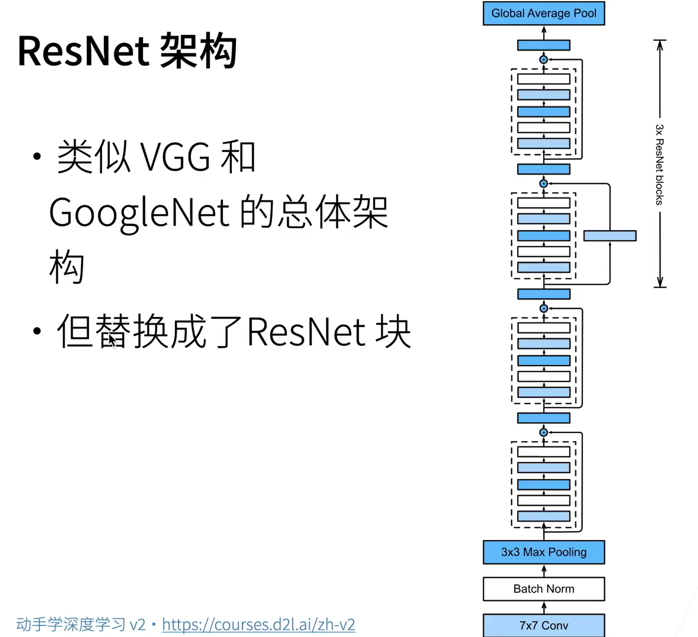

# 原理解释

解释CNN可以从两种思路入手，第一种方式是通过神经网络的角度解释CNN，即将每个识别区看作为一个神经元，各层中的所有神经元通过共享参数实现识别区检测策略的统一。另一种方式是通过卷积层解释CNN，通过一系列的过滤器Filter检测出图片上对应的特性。

## 神经元角度

CNN常应用的范围是图片分类问题，这种问题具有一个通性，那就是分类一张图片可以通过检测图片上各个特征实现。例如检测鸟的时候，如果在图片中检测到喙、眼睛、脚爪等特征，就可以认为这张图片中存在鸟。

因此我们可以把模型简化成，对于每一个较小的识别区（Receptive field）的所有像素通过多个神经元，得到它的特征向量，将这些特征再视为一个多通道的图片，迭代进行，最后将所有信息通过一个MLP神经网络得到分类结果。

需要注意这种过程中：

1. 识别区Receptive Field的大小成为**Kernel Size**，平移单位叫做**Stride**，对整张图片边缘补零的过程称为**Padding**；
2. 在实作时，由于机器采用矩阵运算，所以可以把每个区域上的多个神经元的参数进行共享（**Parameter Sharing**），从而实现并行运算；
3. 为了减少运算，并更好满足**平移不变性**，我们通常也会采用**Pooling池化**技术，将每层神经元得到的结果数量减少，减轻运算量；
4. 由于识别区的大小是固定的，当我们把图片拉大或者缩小之后，CNN容易失效，所以在训练的时候我们通常也会做**Data Augmentation**。
5. 卷积中**输入到输出的关系**是：$ ⌊ (n_h  - k_h + p_h + s_h)/s_h ⌋ * ⌊ (n_w  - k_w + p_w + s_w)/s_w ⌋ $

## 卷积角度

将图片(m * n * channel)的每个像素和通道通过k个过滤器Filter，得到一个通道数为k的张量（Feature Map），依次通过更多的Filter得到特性，再通过MLP进行图像分类。

# 残差网络ResNet

当我们不断增加卷积层的深度时，往往会使得模型的Model Bias不断增大，为了较少这样的问题，我们引入残差块的概念。残差块的思想是将输入的张量分两条路径到达下一层，即通过残差网络和不通过残差网络，将两条路径的输出结果拼凑到一起，从而实现让模型自己决定是否需要增加模型的复杂程度。

# 参考链接

> - [李宏毅CNN讲义](https://speech.ee.ntu.edu.tw/~hylee/ml/ml2021-course-data/cnn_v4.pdf)
> - [李宏毅CNN视频课](https://www.youtube.com/watch?v=OP5HcXJg2Aw)
> - [李沐ResNet视频课](https://www.bilibili.com/video/BV1bV41177ap)

