# 问题分析

分析模型在训练集和测试集的表现时，常见的策略如下为：

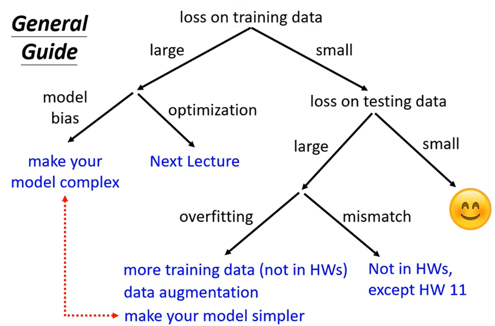
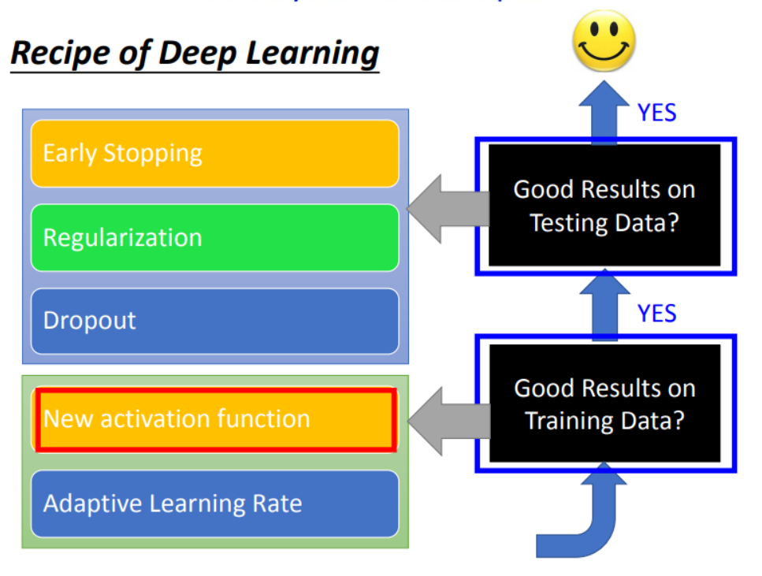

## 训练集TrainingSet表现差

1.模型过于简单（Model Bias）

形象的讲就是：`在大海里捞针，针不在大海里`； 常见的策略是让模型变得复杂化，使可以得到的Function中能够有一个符合较低的Loss

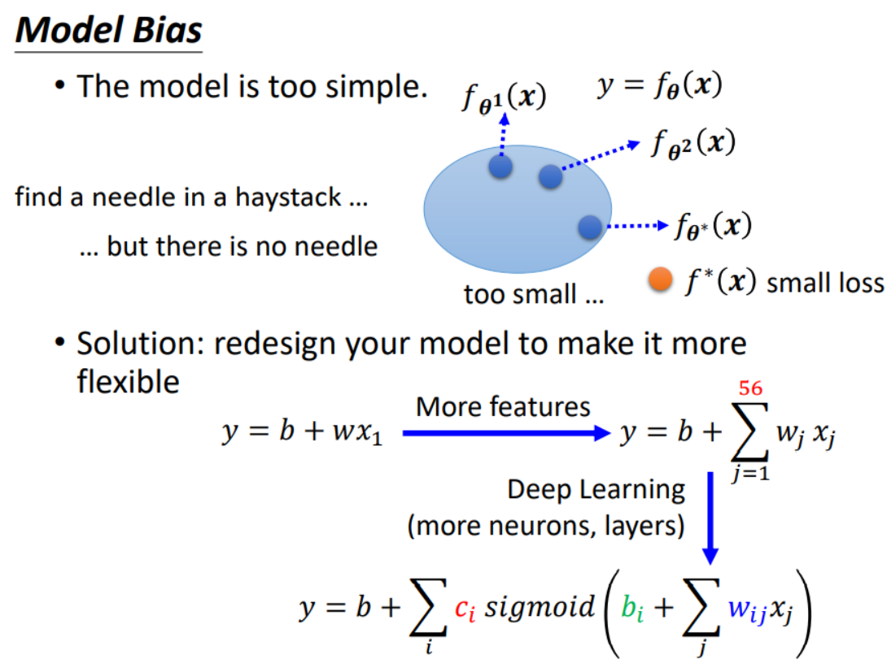

2.优化器做的不够好（Optimization）

形象的讲就是：`在大海里捞针，针就在大海里，但却捞不到`；这是往往需要对Optimizer进行优化，例如SGD中调整LR或Monument等超参数。

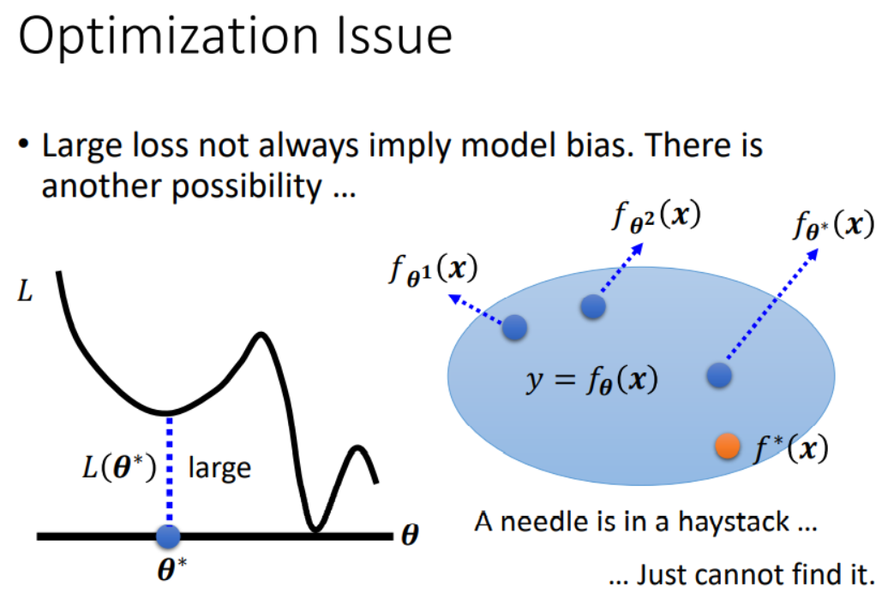

通常解决这样的方法就是将`SGD`随机梯度下降改为`Adam`并设置`weight_decay`作用L2正则化。

3.模型过于复杂（Model Bias）

形象的讲就是：`在大海里捞针，但不知道在哪片海`；在CNN卷积影像识别领域中，可以利用ResNet残差网络进行优化解决。

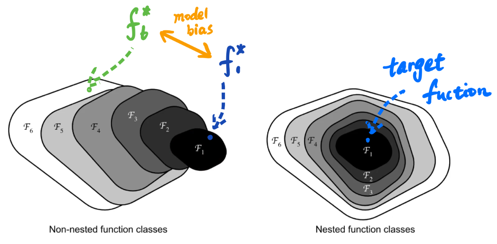

因此，当我们遇到训练的模型在训练集上表现差时，可以试着以下策略：

> - 用一个比较**简单**的Model在训练集上进行训练，得到最终的损失Loss 0；
> - 用一个较为**复杂**的Model在训练集上进行训练，得到最终的损失Loss 1；

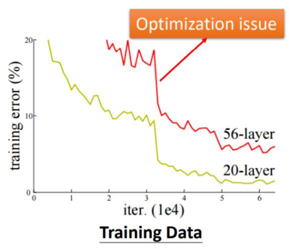

如果`Loss 1`并没有比`Loss 0`增加很多，则考虑是`Optimization`出现问题，反之就是`Model的复杂度`不够高。
但是也要注意，当模型复杂度过高的时候，也会出现问题。假设梯度下降不存在问题，在测试集的损失Loss未必会随着模型复杂度增加而减少（过拟合`Overfitting`问题）。

## 测试集Testing Set表现差

通常在训练集上表现得不错，但在测试集却表现的不尽人意，则可以称为过拟合`Overfitting`问题

解释过拟合，举个极端的例子如下：

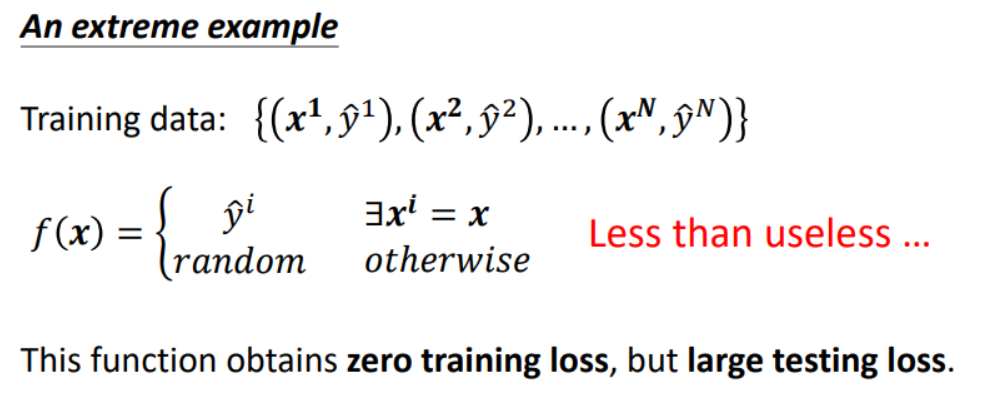

过拟合问题中，可能是因为我们的模型`过于弹性`，会出现如下问题：

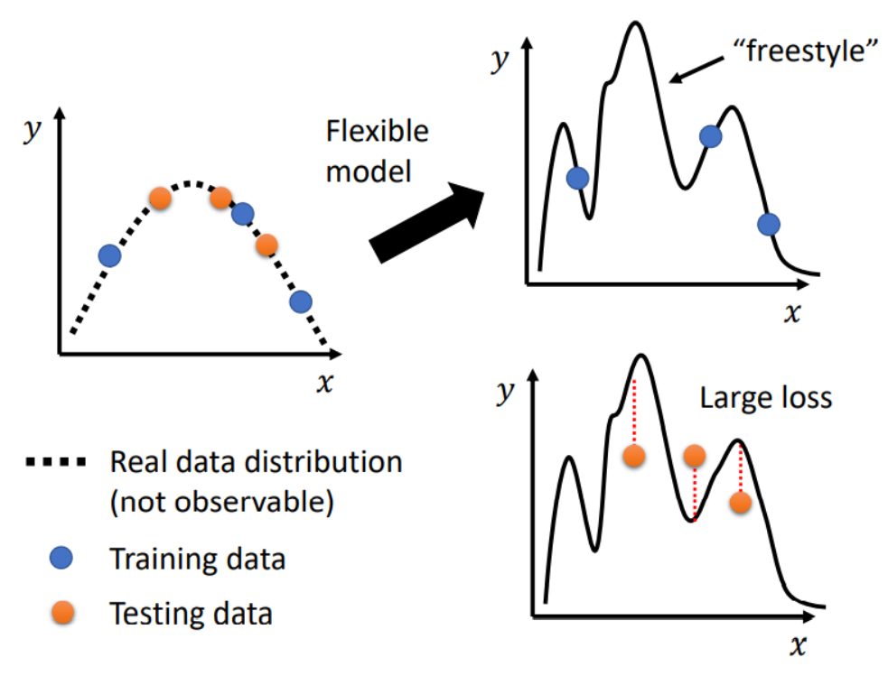

应对的策略可以是，基于我们的Domain Knowledge领域知识，自己设计测试样例训练模型。

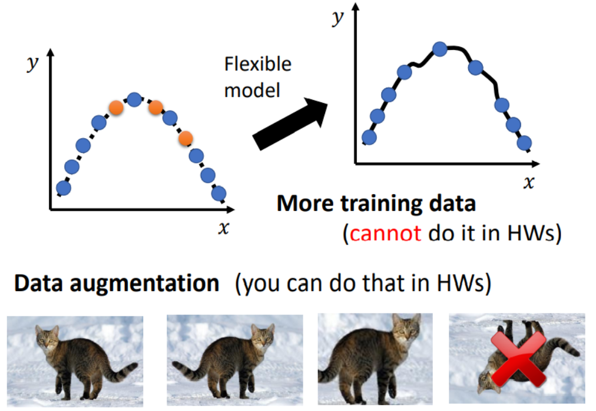

其他的策略还有：
> - less / share parameter: 共享参数（例如CNN中利用神经元解释卷积过程）
> - less feature: 减少特征类型带来的影响
> - early stopping: 避免过拟合现象
> - normalization: 归一化（例如特征归一化等）
> - regularization: 正则化（例如L2正则，让下降更平缓）
> - dropout: 训练时让某层的神经元以某种概率随机失效

另外，附上模型复杂度和模型在测试集上的关系图。

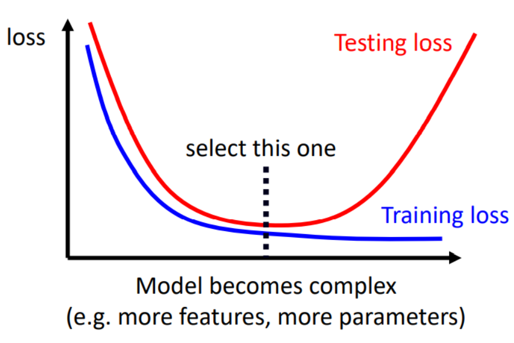

# 策略手册

## 调整训练集的总量、特征数量

### Data Augmentation

通过`Data Augmentation`在原数据集上增量，常见的例如`CNN`中对图片进行放大。

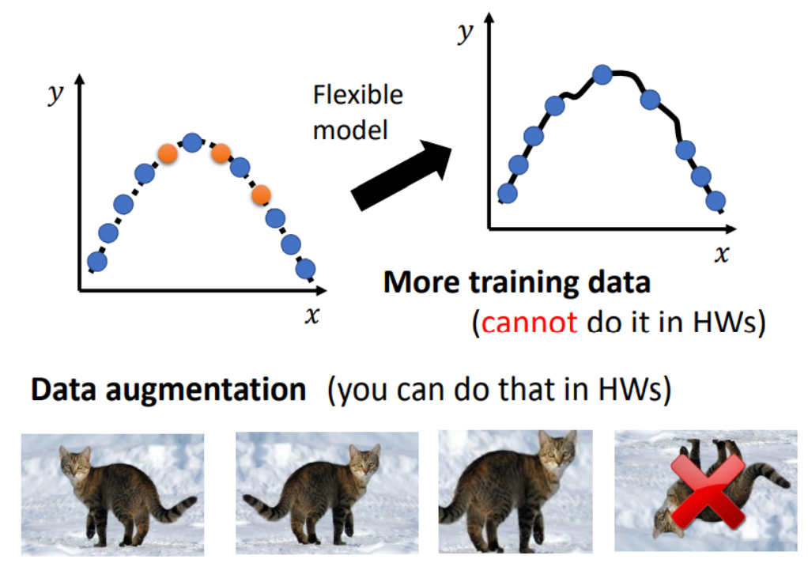

### Semi-Supervisor

利用**半监督**学习`Semi-Supervisor`，在训练过程中增加训练集的数据量。

例如在`Classification`分类任务中，每个训练迭代器寻找`softmax`后**预测概率超过特定阈值**的数据用于下一轮训练。

### Feature Engineering

对特征`features`数量进行增加或删除。

### Feature Normalization

采用`Feature Normalization`特征归一化。

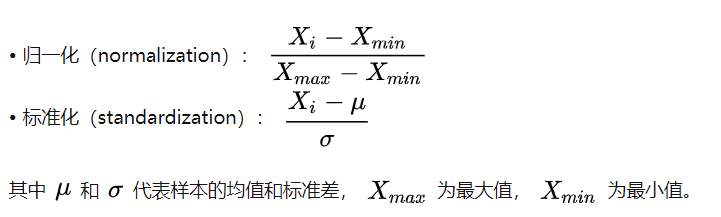

## 模型Function/Model改进

### Deep Neural

调整神经网络的深度和大小，通常`小模型=>大模型`进行测试。

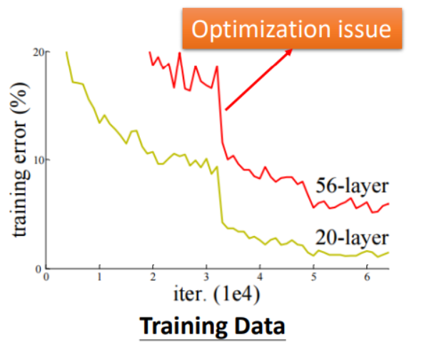

### Activation Function

调整激活函数`Activation Function`，常见的激活函数：

> - Sigmoid: $\sigma(x) = \frac{1}{1+e^{-x}}$
> - ReLU: $\sigma(x) = max(0, b+wx)$
> - Maxout: $\sigma(x) = max(b_1+w_1 x, b_2+w_2 x)$

`Sigmoid`在深度神经网络中，具有明显的缺陷，及离输出层越远的神经元，越难被更新到，有时训练结束后，离输出层较远的神经元权值可能仍然是随机的。

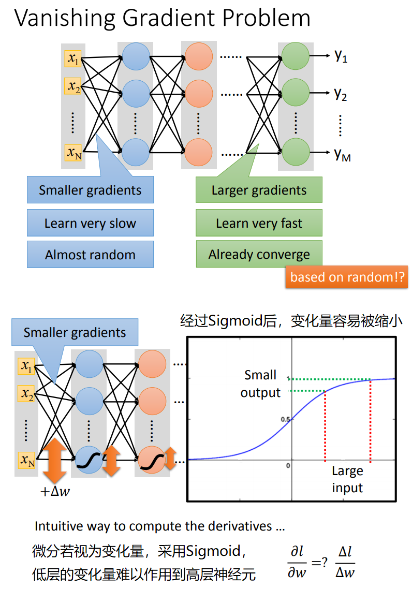

`ReLU`是深度神经网络中，最常用的激活函数，它克服了`Sigmoid`的一些问题。

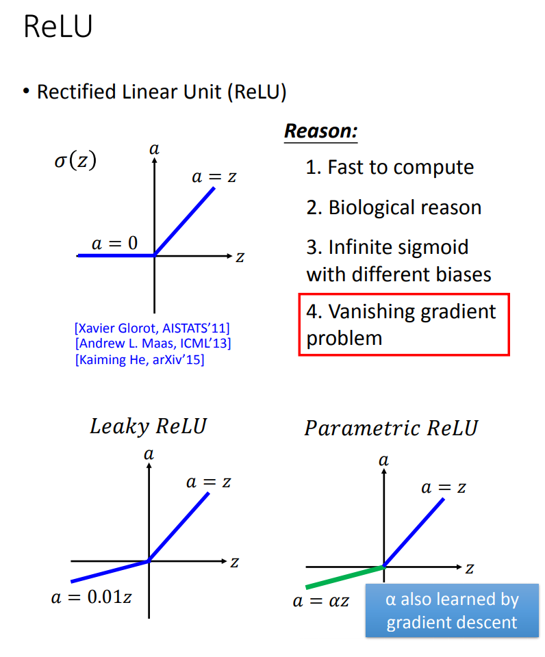

当然，也可以引入自学习的Activation Function，这就是常用的`Maxout`激活函数，通常可以认为，`ReLU`就是`Maxout`的一种特例。

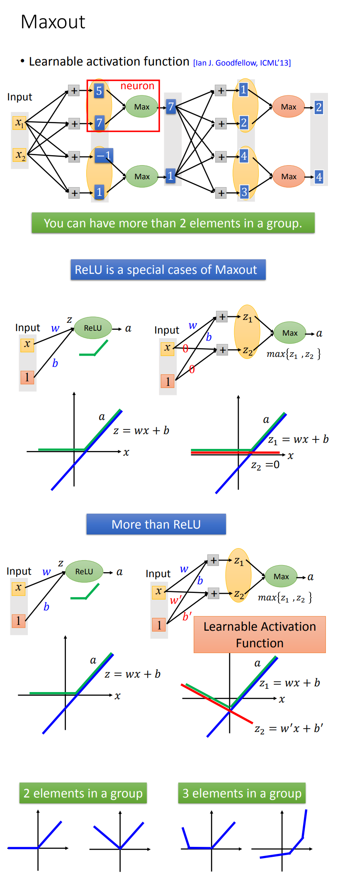

### Dropout

Dropout在每一层中以概率$p$随机使某些神经元失效，使得神经网络更加thinner。
> - 训练时`model.train()`，以概率$p$使某些神经元失效；
> - 测试时`model.eval()`，以概率$1-p$乘上每个神经元的权重；

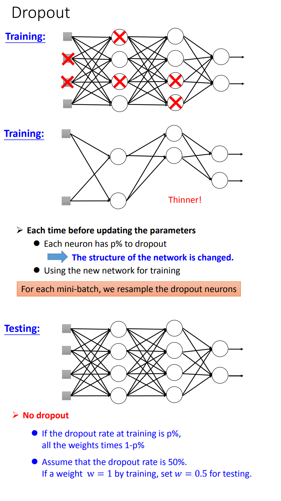

之所有要在测试时，乘上$1-p$的原因是在验证时，相比于训练时是所有神经元参与工作。

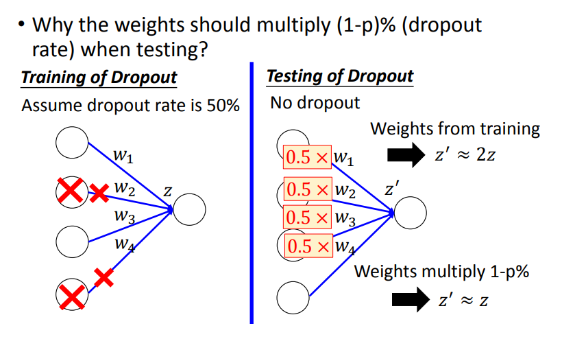

### Residual Block

将神经网络拆分成Block块，每个块到下一个块的路径有两条，一条是经过神经网络后到达，另一条路径是输入向量直接到达下一个残差块。将两条路径输出的向量拼接到一个向量传递到下一个Block。以此可以消除Model Bias的问题。残差块的应用如ResNet，在加深神经网络的时候，解决网络退化的问题。关于ResNet和Residual Block的理解可以参照[李沐ResNet](https://www.bilibili.com/video/BV1bV41177ap)讲解。

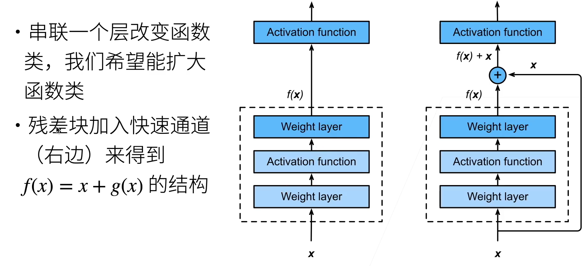

## 损失函数Loss改进

### Loss Function

选择合适的`Loss Function`

> - Regression : MSE / RMSE
> - Classification: CrossEntropy

### Regularization正则化

L2正则化可以使Loss损失函数下降的更加平缓，不容易出现过拟合的现象。

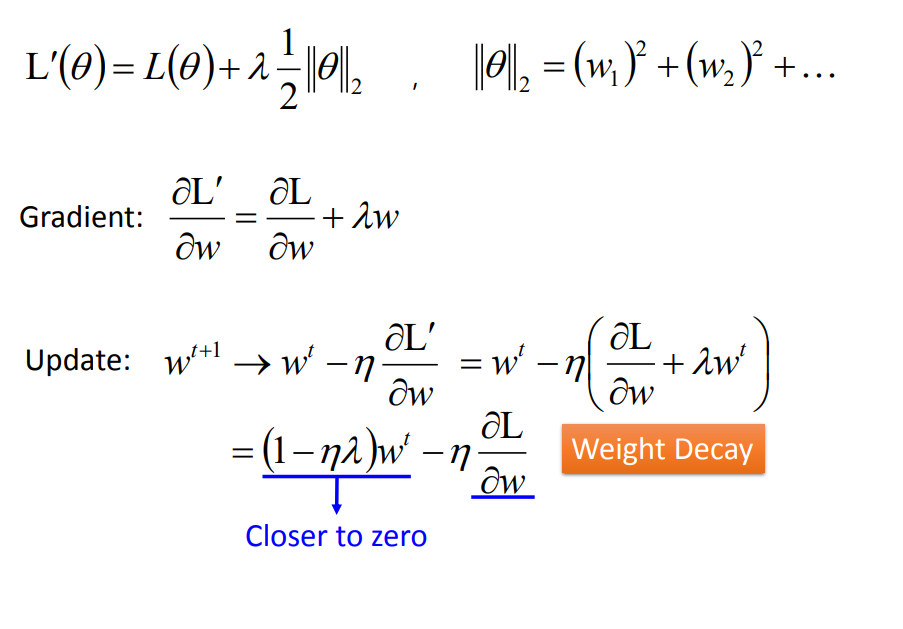

可以想象一下采用了L2正则化的函数，在下降过程中，某些权重`weight`会更快的下降到趋近于0，这使得在梯度下降过程中越接近0的权重更快的向0迭代，从而导致某些神经元被淘汰，因此对模型进行了适当的缩小，不容易出现过拟合问题。

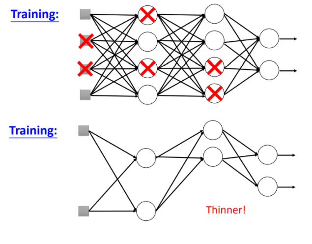

## 优化器Optimization改进

### Learning Rate & Momentum

使用`SGD`时，可以对`learning rate`和`momentum`进行优化，其两参数的具体数学含义可以见梯度下降介绍。

```
learning rate <= 0.01
momentum = 0.8 ~ 0.9
```

### Adam

在SGD不能给出比较好的下降效果时，可以考虑使用`Adam`进行**自适应的learning rate**下降。

## 训练过程Training Process改进

### Epochs & BatchSize

调整`epochs`迭代次数以及`batch size`批大小

通常epochs的次数不易过大，否则会出现过拟合问题；

对于Batch Size，即在某次迭代中，取一定尺寸的批数据进行梯度下降。
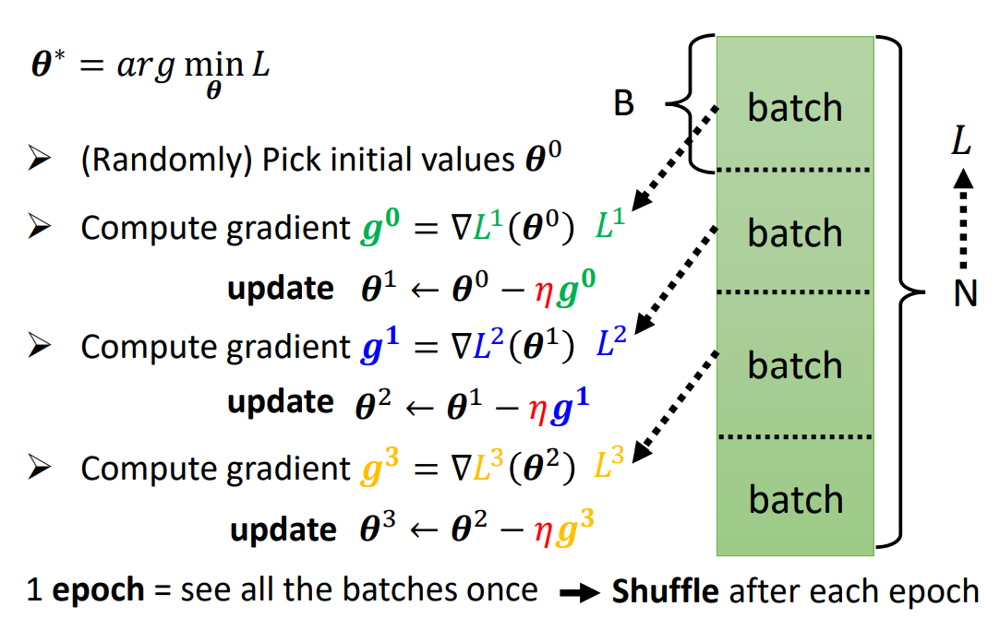

需要注意的是，更小的Batch往往不能在CPU/GPU上更好的并行运算，所以下降运算速度会比较大的Batch慢。

但是，在每一次下降中，都会对应不同的Loss函数曲线，这样在真正分布的Loss上进行梯度下降会产生Noisy噪声，它的正是在于**不容易卡在Critical Point上**。

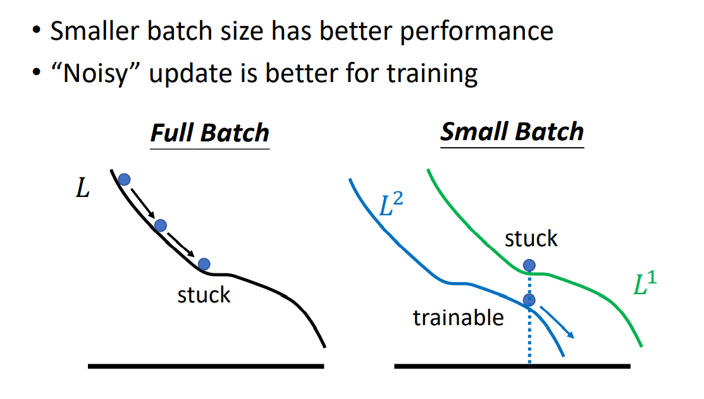

其实，更小的Batch甚至可以在Testing Set上获得不错的表现。解释这个现象需要注意的是，不同的local minima就算可使Loss相等，也是有好坏之分的。 在Training Set上，相同的local
minima中，开口越平缓（二阶导数越小）的local minima会更好。因为相对于在Testing Set上，其Loss曲线往往和Training Set的Loss曲线不完全一致，但相接近。此时，平缓的local
minima有更好的容错区间，下图阐释了这样的现象：

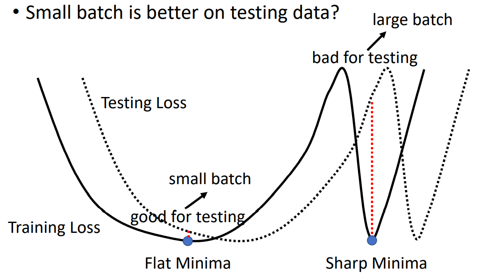

接下来，我们对**Small Batch v.s. Large Batch**进行总结比较：

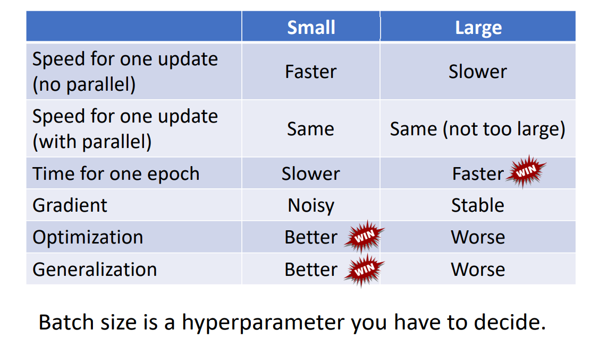

### early-stop

通常在训练迭代过程中，为了防止过拟合Overfitting，可以在验证集损失持续某段时间后立即终止迭代。

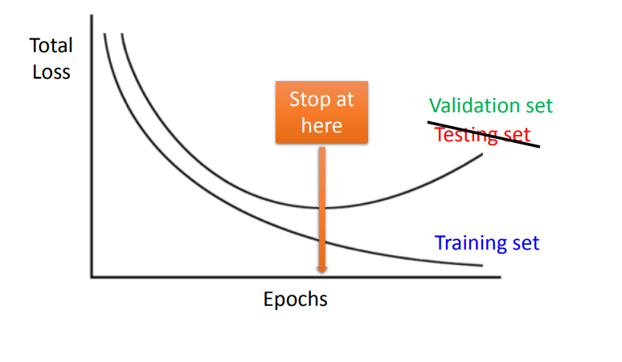

# 参考链接

> - [机器学习任务攻略（李宏毅）2021 PDF](https://speech.ee.ntu.edu.tw/~hylee/ml/ml2021-course-data/overfit-v6.pdf)
> - [机器学习任务攻略（李宏毅）2021 YouTube](https://www.youtube.com/watch?v=WeHM2xpYQpw)
> - [机器学习任务攻略（李宏毅）2021 Bilibili](https://www.bilibili.com/video/BV1Wv411h7kN?p=10)
> - [神经网络任务攻略（李宏毅）2017 PDF](https://speech.ee.ntu.edu.tw/~tlkagk/courses/ML_2017/Lecture/DNN%20tip.pdf)
> - [神经网络任务攻略（李宏毅）2020 YouTube](https://www.youtube.com/watch?v=xki61j7z-30)