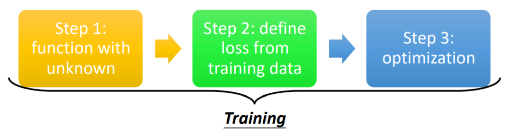
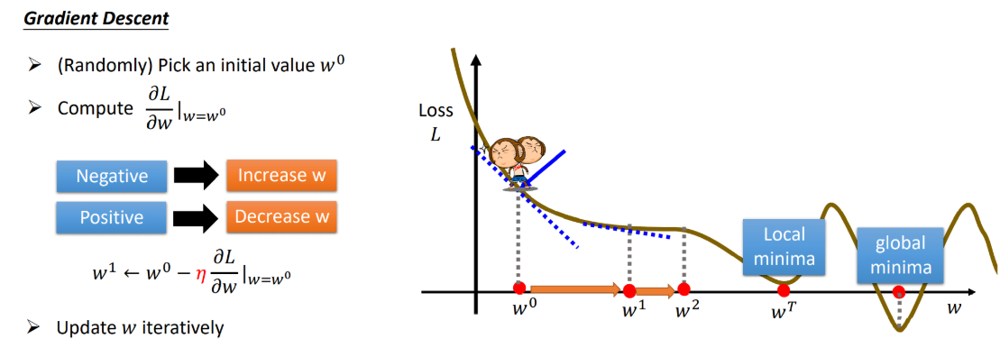
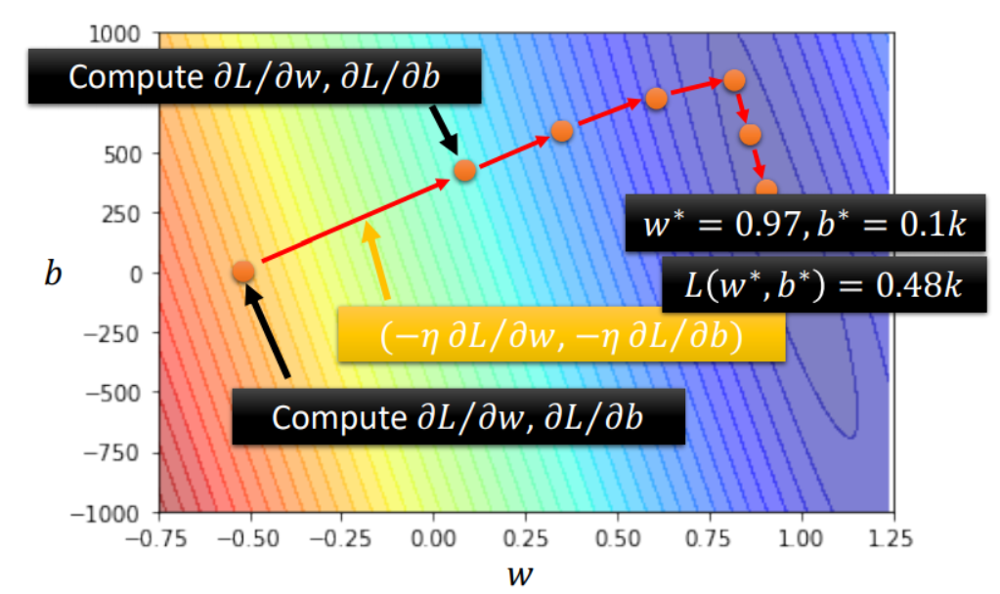

# 机器学习的训练步骤

> - Step 1: **function** with unknown
> - Step 2: define **loss** from training data
> - Step 3: **optimization**

# 函数式Function

## 函数分类

> - Regression: 输入1个向量，输出1个向量（连续的值）
> - Classification: 输入1个向量，输出1个向量（离散的值）
> - Seq2Seq: 输入N个向量，输出M个向量（输入的向量间有关联）
> - Structured Learning: 创造含有结构的文档、图片、音乐等

## 参数术语

例如，对于一个基础的线性模型Linear Model，其Function可以表示为：

$y = b + (w_1,...,w_n)^T (x_1,...,x_n)=b+WX$

对于上述式子，则可以称：

> - X: 特征（feature）
> - W: 权重（weight）
> - b: 偏置（bias）
> - $\theta$: $(W,b)^T$​等构成的向量

传统的线性回归模型，为了实现简单的**非线性化**，可以通过Basis Function实现：

$y=b+W·\phi(X)$

其中可以称$\phi(X)$为基函数，常见的基函数有：

> - 多项式基函数：$\phi(X)=\sum_{i=1}^n x_i^i$
> - 高斯基函数：$\phi(X)=\sum_{i=1}^n e^{-\frac{(x_i-\mu_i)^2}{2s^2}}$​

## 激活函数

在机器学习中，为了拟合**非线性**的分布曲线，通常需要通过多个激活函数进行叠加，常见的激活函数有：

- Sigmoid: $\sigma(x) = \frac{1}{1+e^{-x}}$
- ReLU: $\sigma(x) = max(0, b+wx)$
- Maxout: $\sigma(x) = max(b_1+w_1 x, b_2+w_2 x)$

# 损失函数Loss

损失函数表示了当前模型在某个数据集合上的质量，因此损失函数Loss是一个含参函数。对于一般的Linear Model，可以定义其损失函数为：

- MAE(Mean Absolute Error):
  $L(\theta) = \frac{1}{n} \sum_{i=1}^n \mid y_{\theta}(X_i) - \hat{y} \mid$

- MSE(Mean Square Error):
  $L(\theta) = \frac{1}{2n} \sum_{i=1}^n (y_{\theta}(X_i) - \hat{y})^2$

- RMSE(Root Mean Square Error):
  $L(\theta) = \frac{1}{n} \sqrt{ \sum_{i=1}^n (y_{\theta}(X_i) - \hat{y})^2 }$

- CrossEntropy(Always Used in Classification):
  $L(\theta) = \frac{1}{n} \sum_{i=1}^n ( \sum_{j=1}^m -\hat{y_j^i} \ln{y_\theta(X_j^i)} )$

需要注意的是，为了方便梯度下降求微分，MSE和RMSE最好再乘上$\frac{1}{2}$。

其中`Regression`回归任务多使用`MSE`作为损失函数，而`Classification`分类任务多使用`CrossEntropy`交叉熵作为损失函数。

# 优化器Optimization

优化器Optimization的任务是使损失函数Loss尽可能地小。常见的优化器就是梯度下降（`Gradient Descent`）算法系列。

梯度下降的目标在于：$\theta^* = argmin {L(\theta)}$，其步骤如下：

其中，梯度下降的基本方程是：$\theta^{t+1} \gets \theta^{t} - \eta * \nabla L(\theta^t)$

## 下降结果(Critical Point)

> - Local Minima: 局部最小值
> - Saddle Point: 鞍点（各方向的微分为0，但仍具有下降可能）

## Gradient Descent分类

> - VGD(Vanilla Gradient Descent): 一般的梯度下降法
> - MBGD(Mini-Batch Gradient Descent): 小批量梯度下降法
> - SGD(Stochastic Gradient Descent): 随机梯度下降法
> - Adagrad: 学习率自适应的梯度下降法
> - RMSProp: 改进的学习率自适应的梯度下降法
> - Adam(RMSProp + Momentum): 自适应稳定梯度下降算法

# 参考链接

> - [李宏毅机器学习2021](https://speech.ee.ntu.edu.tw/~hylee/ml/2021-spring.html)
> - [李宏毅机器学习视频课Youtube](https://www.youtube.com/watch?v=Y87Ct23H3Kw)
> - [李宏毅机器学习视频课Bilibili](https://www.bilibili.com/video/BV1Wv411h7kN?p=2)
