# Gradient Descent的数学证明

根据多元泰勒展开式，当`$(x,y)$`无限接近`$(x_0,y_0)$`时，省略皮亚诺余项，`$h(x,y)$`可以表示为：

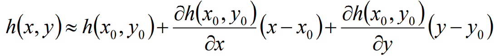

由上式可以得到损失函数在某点`$L(a,b)$`的邻域内，`$L(\theta)$`可以近似的表示为如下：

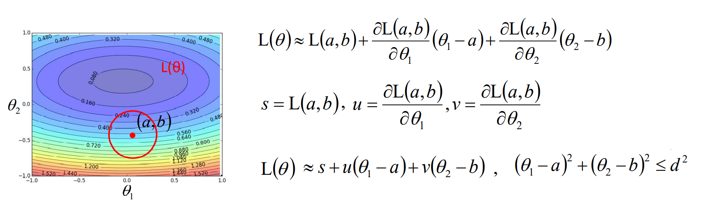

为了使`$L(\theta)$`变小，可以将`$L(\theta)$`写成两个向量内积形式，则当两个向量反向且`$(\Delta \theta_1,\Delta \theta_2)$`刚好达到邻域边界时，可保证`$L(\theta)$`
取得最小值：

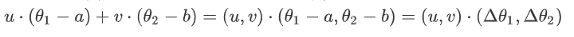

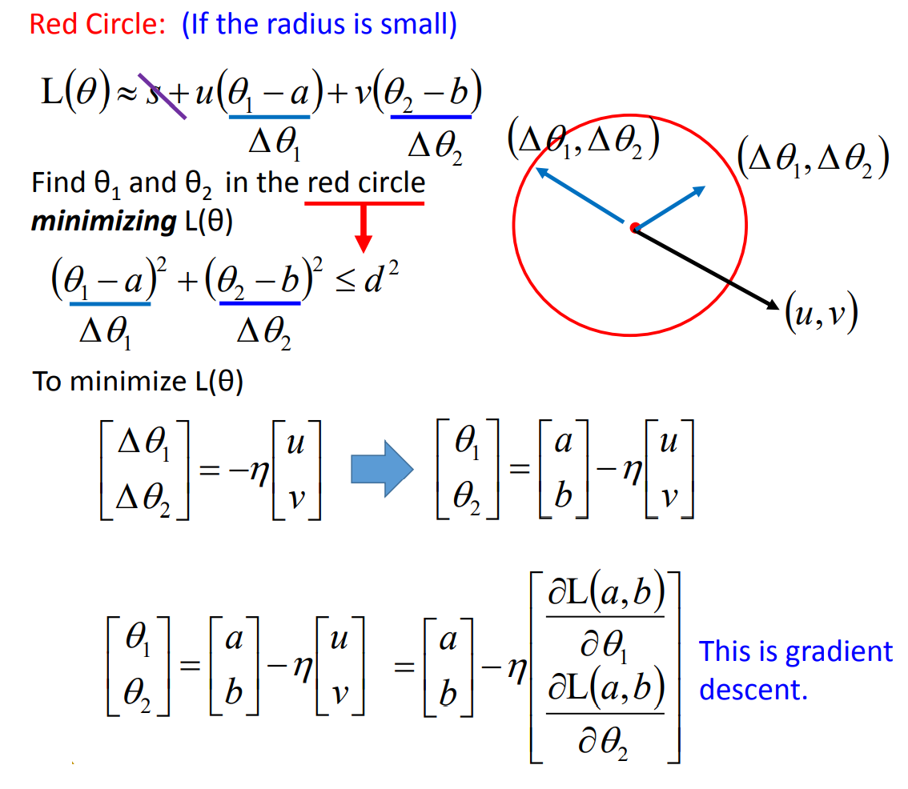

其中我们可以看到，当`$\eta$`(learning rate)太大超过了邻域时，就会超出泰勒公式`$L(\theta)$`的近似区间，此时并不能保证梯度下降的正确性。

# Critical Point问题

Critical Point通俗的将，就是Loss Function下降到某个位置不能再继续下降了（各维度的微分都为零）导致的现象。

Critical Point可以分为：
> - Local Minima: 局部最小值
> - Saddle Point: 鞍点

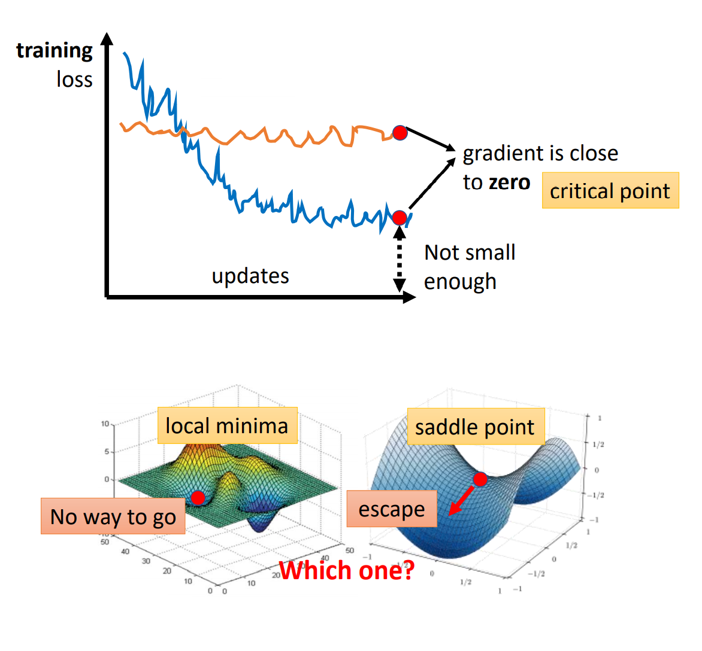

接下来我们将从数学角度讨论如何判别`Critical Point`是`Local Minima`还是`Saddle Point`。

## 判别Local Minima / Saddle Point

利用多元泰勒展开式，当我们下降到`$\theta'$`的时候，`$L(\theta)$`在`$\theta'$`的一个很小的邻域范围内，可以近似表示成：

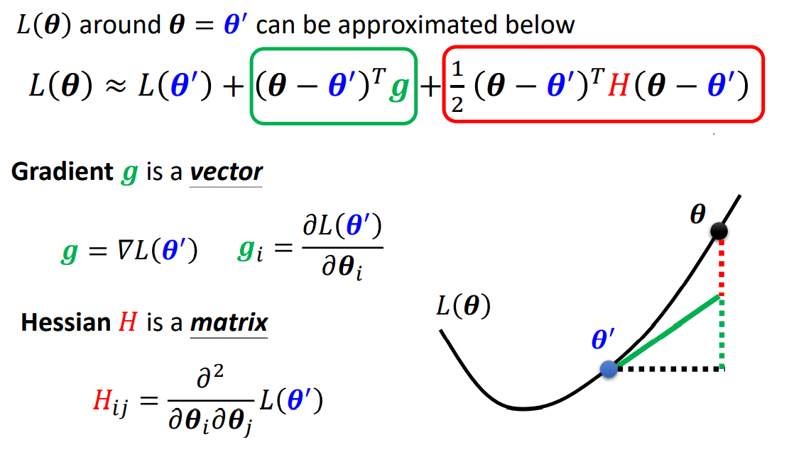

此时在`Saddle Point`处，一阶微分均为零，则`$L(\theta)$`又可以被近似的表示成：

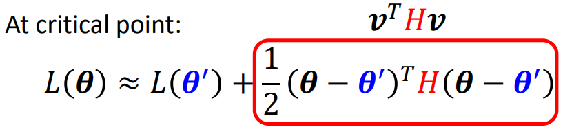

到此位置，利用线性代数的`二次型理论`，我们可以利用矩阵`$H$`的特征值讨论后项是恒正恒负，以此判别`Local Minima / Saddle Point`。

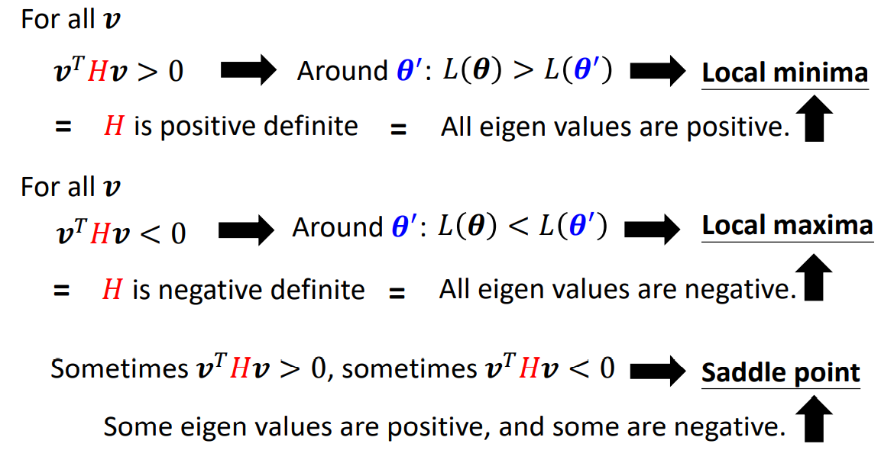

若`二次型理论`遗忘，可见下列的结论即可：

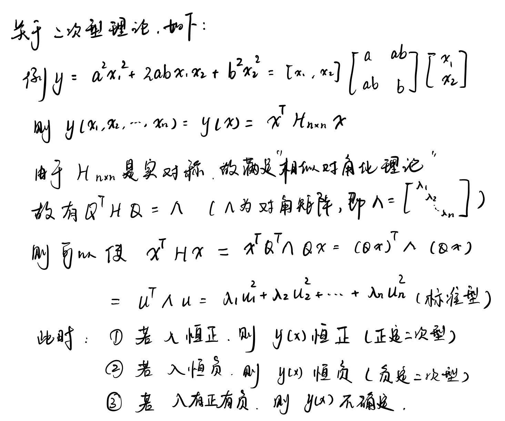

## Saddle Point处怎么下降

上图泰勒展开式中，观察最后一项，怎么找一个`$\theta$`使它为负数，即可使`$L(\theta)<L(\theta')$`即可。

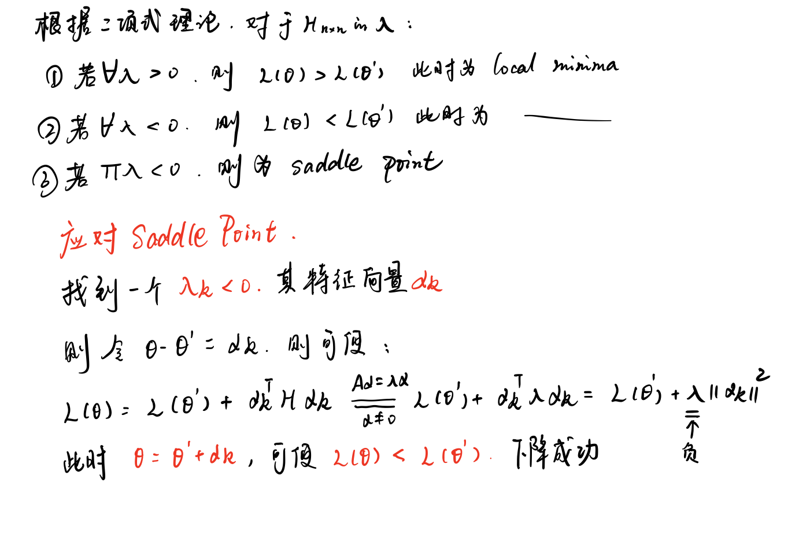

# Learning Rate问题

## Learning Rate过高或过低带来的问题

> - Learning Rate very large: 如上节证明，不能保证泰勒定义的近似性，因此不保证梯度下降的正确性；
> - Learning Rate very small: 下降的速度太慢了，需要很久达到Loss的最小值。

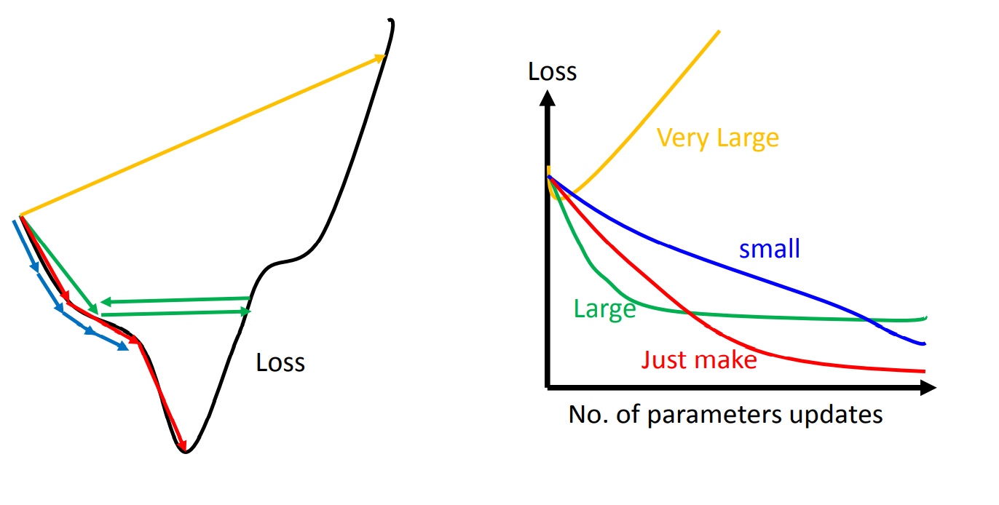

## 如何动态调整Learning Rate

动态调整`Learning Rate`在于: 前期下降更快，而后期接近最小损失时下降尽可能减缓。

**最基本、最简单的大原则是：Learning Rate通常是随着参数的更新越来越小的**

这里我们逐步引入各种`Optimization`优化器进行比较

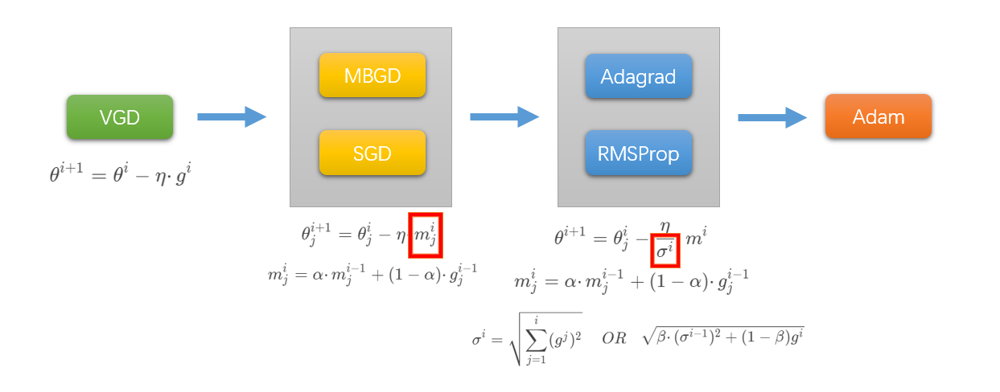

### VGD (Vanilla Gradient Descent)

(Vanilla) Gradient Descent 是我们认为最一般的梯度下降法。

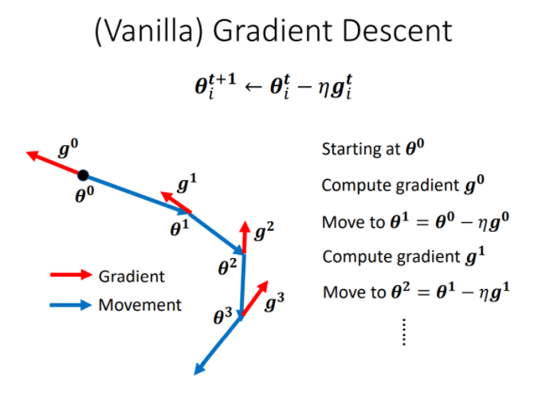

### MBGD & SGD

- MBGD: Mini-Batch Gradient Descent
- SGD: Stochastic Gradicent Descent

相对于一般的`VGD`梯度下降法，小批量梯度下降在于对每个小的Batch计算微分后，就立刻更新$\theta$，可以**更快的进行下降**。

随机梯度下降`SGD`是对`Mini-Batch Loss`的实现方法可以让训练更快速，传统的Gradient Descent的思路是看完所有的样本点之后再构建Loss Function，然后去更新参数；而Stochastic
Gradient Descent的做法是，看到一个样本点就更新一次，因此它的Loss Function不是所有样本点的Error平方和，而是这个随机样本点的Error平方。

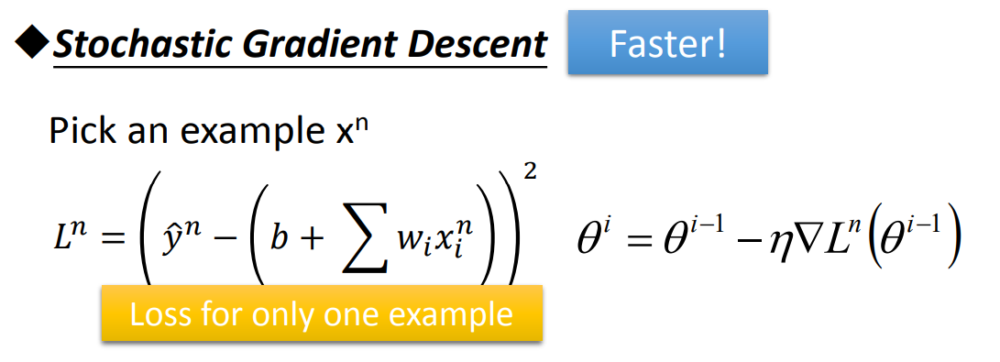

经历一次样本更新后，Stochastic Gradient Descent与传统Gradient Descent的效果对比如下：

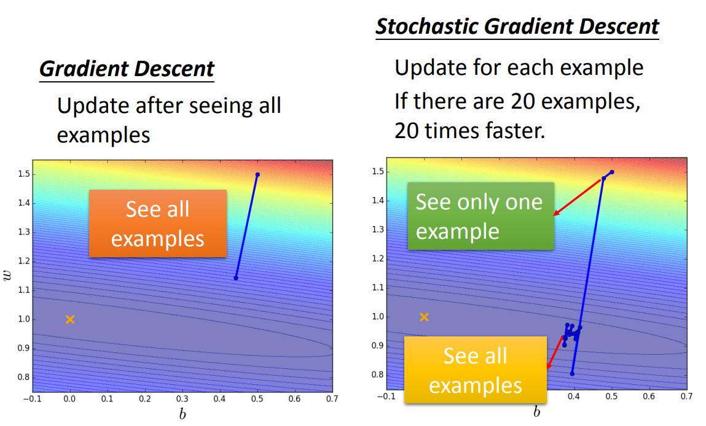

### Adagrad

Adagrad是最原始的自适应梯度下降算法，Adagrad需要解决如下问题：

对于一个Function，其Loss Function在Trainning Set上不断下降的训练过程中，可能最终会出现Loss无法继续下降的现象。

该问题未必是由于遇到Critical Point(Local Minima/Saddle Point)导致的，下图给出一个具体的例子：

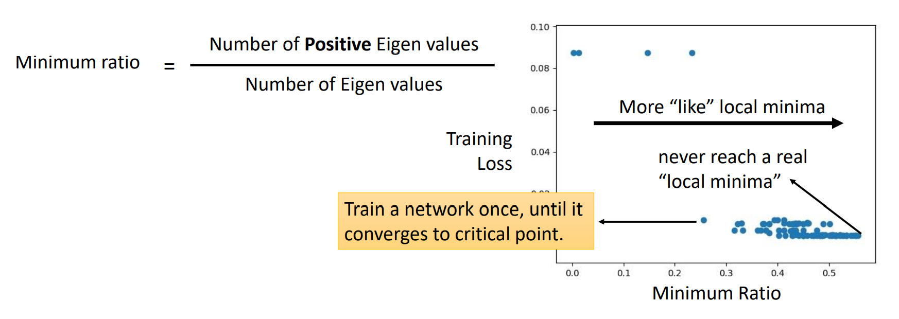

（Ratio：正负特征值的笔直。特征值指的是对于Local Minima的判别，具体参照上节Critical Point的介绍。简单地说是通过Loss Function在某一点处`矩阵表示的泰勒公式`中，二阶导数构成矩阵的特征值进行判别。）

而导致Loss无法继续下降的原因大多是因为Optimization自身出现了问题。

- 问题： `Larning Rate`太大，导致每次更新的步长太大。

对于不同的维度feature，设置不同的Learning Rate，并且让Learning Rate可以**根据之前的Gradient梯度下降值动态变化**，具体方式如下：

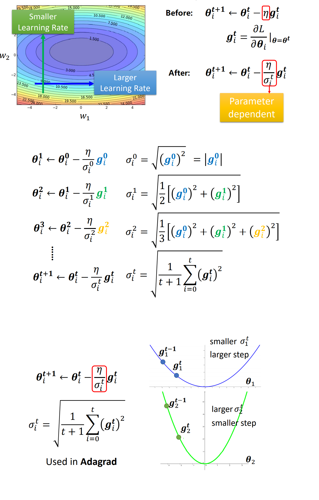

### RMSProp

为了让Learning Rate有更好的弹性，我们对`Adagrad`进行了改进，我们利用`RMSProp`方法，让Learning Rate在平缓的地方下降的更快，陡峭的地方下降的更慢。

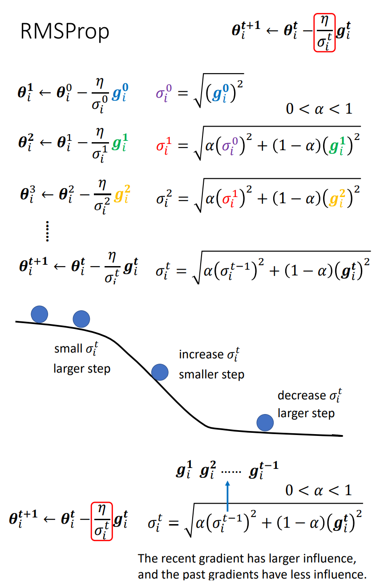

- 问题： 长时间只在某个维度下降，可能导致在另一个维度上LearningRate骤增。

当长时间在只在某个方向上进行梯度下降，可能会导致另一个维度上LearningRate骤增，这时候会出现下图中的问题：

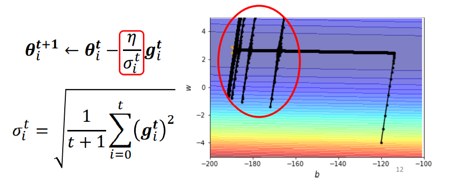

为了应对这样的问题，我们通常有两种方式处理：
> - Learning Rate Decay
> - Warm Up

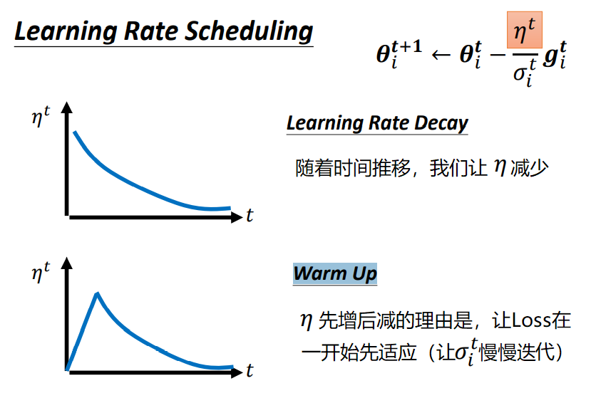

### Adam (RMSProp + Momentum)

`Adam`是对之前所有梯度下降算法的一次集大成，是目前较为广泛应用的梯度下降算法，**代替了Adagrad和RMSProp的使用**。

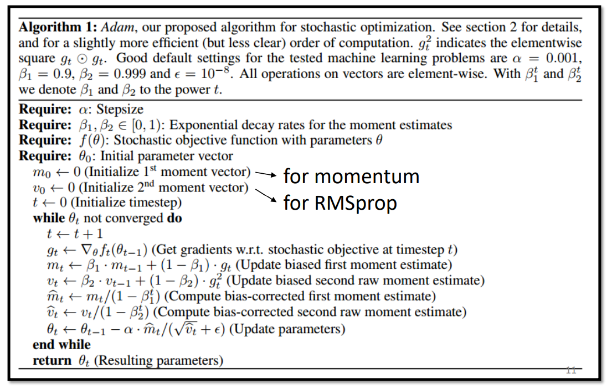

# BatchSize

DNN的训练过程中，往往是将Training Set划分为各块Batch，各块进行梯度下降。 所以更新的次数`Update = Epochs / BatchSize`。

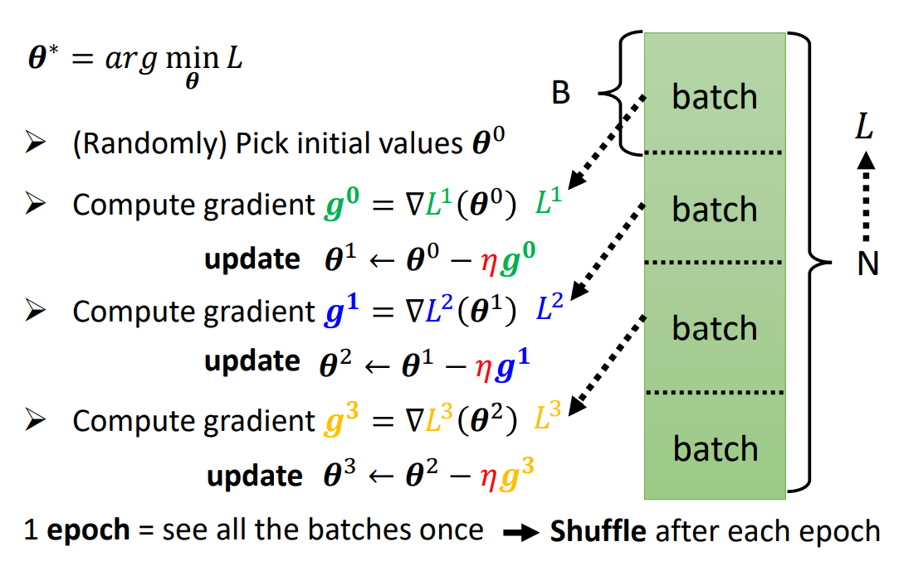

需要注意的是，更小的Batch往往不能在CPU/GPU上更好的并行运算，所以下降运算速度会比较大的Batch慢。

但是，在每一次下降中，都会对应不同的Loss函数曲线，这样在真正分布的Loss上进行梯度下降会产生Noisy噪声，它的正是在于`不容易卡在Critical Point上`。

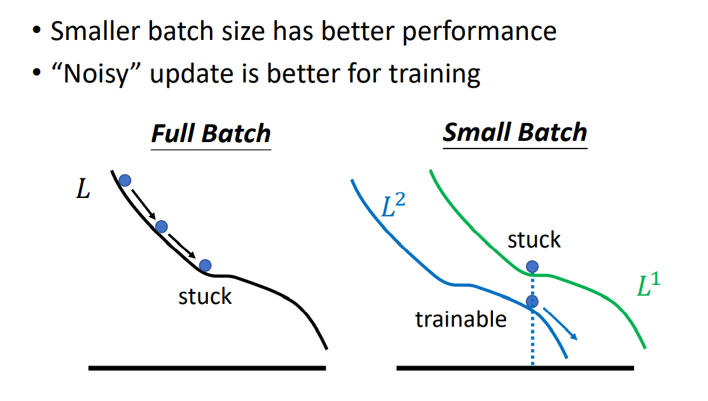

其实，更小的Batch甚至可以在Testing Set上获得不错的表现。解释这个现象需要注意的是，不同的local minima就算可使Loss相等，也是有好坏之分的。 在Training Set上，相同的local
minima中，开口越平缓（二阶导数越小）的local minima会更好。因为相对于在Testing Set上，其Loss曲线往往和Training Set的Loss曲线不完全一致，但相接近。此时，平缓的local
minima有更好的容错区间，下图阐释了这样的现象：

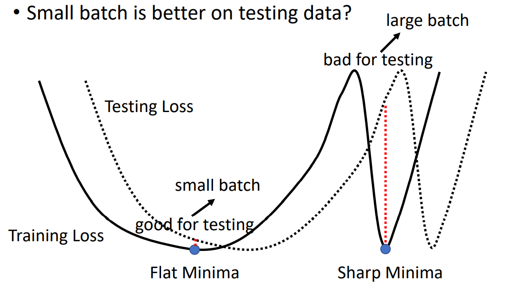

接下来，我们对Small Batch v.s. Large Batch进行总结比较：

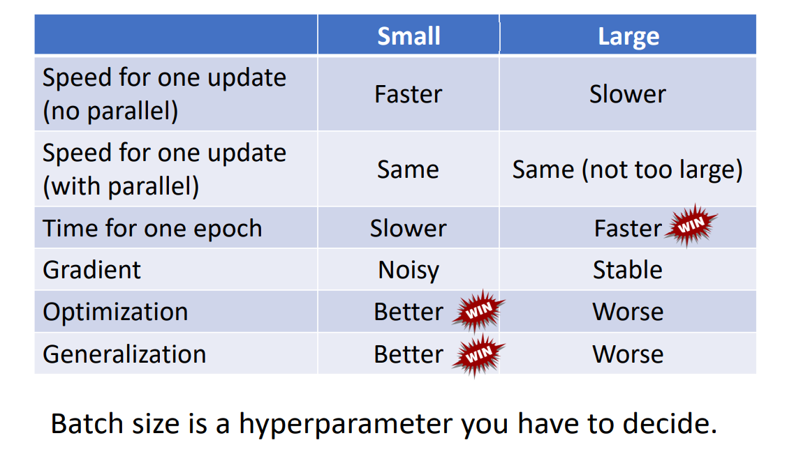

# Momentum

Momentum就是为梯度下降增加惯性，使其下降的过程更富有物理弹性。

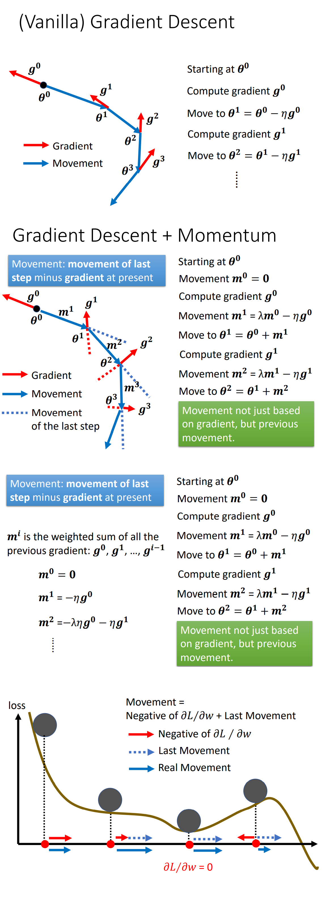

经过一系列的优化改进，我们可以最终把Gradient Descent理解成如下公式：

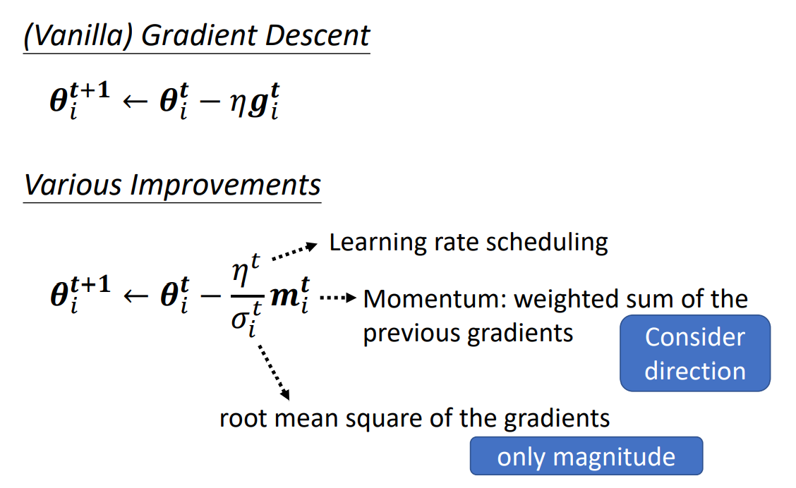

# 参考链接

> - [李宏毅梯度下降2016讲义PDF](https://speech.ee.ntu.edu.tw/~tlkagk/courses/ML_2016/Lecture/Gradient%20Descent%20(v2).pdf)
> - [李宏毅梯度下降2016视频Youtube](https://www.youtube.com/watch?v=yKKNr-QKz2Q)
> - [Gradient Descent 2016总结PDF](https://sakura-gh.github.io/ML-notes/ML-notes-html/5_Gradient-Descent.html)
> - [李宏毅Critical Point 2021讲义PDF](https://speech.ee.ntu.edu.tw/~hylee/ml/ml2021-course-data/small-gradient-v7.pdf)
> - [李宏毅Adaptive Learning Rate 2021讲义PDF](https://speech.ee.ntu.edu.tw/~hylee/ml/ml2021-course-data/optimizer_v4.pdf)
> - [李弘毅Adaptive Learning Rate 2021视频课Youtube](https://www.youtube.com/watch?v=HYUXEeh3kwY)
