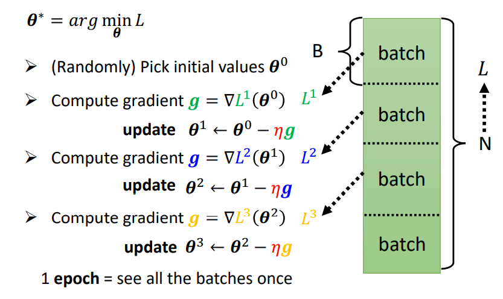

# 函数Function的定义

通常为了处理**非线性**问题，可以通过SVM（支持向量机）或DNN（深度神经网络）解决。

由于`Linear Model`太过单一，无法处理非线性问题，因此我们认为需要拟合出来的一个非线性的超平面，往往可以由一个常数和一系列激活函数（Activation
Function）构成的超平面。例如下图中非线性曲线的函数式可以由一个常数和多个激活函数构成。

而我们所经常使用的激活函数（Activation Function）包括：

> - Sigmoid Function
> - ReLU Function

因此，我们的机器学习Function可以表示为：

通过图示进行表示，可以写为：

因此可以认为这个就是一层（Hidden Layers Only One）的神经网络（Neural Network），我们称所有的未知参数称为向量`theta`。而多层的Neural Network可以表示成如下：

# 损失函数Loss的定义

称所有的参数构成向量`$\theta$`，利用Gradient Desent对`$L(\theta)$`进行优化即可。

# 优化器Optimization的定义

神经网络的梯度下降从一般化的思路来讲可以类似于线性模型，但是对于求导，具有一定的技巧（BackPropagation）。

由于我们每次是选取数据集上某些区块的数据进行训练，因此GradientDesent又可以表示为：

# 参考链接

> - [李宏毅机器学习2021](https://speech.ee.ntu.edu.tw/~hylee/ml/2021-spring.html)
> - [课件PDF](https://speech.ee.ntu.edu.tw/~hylee/ml/ml2021-course-data/regression%20(v16).pdf)
> - [视频课Bilibili](https://www.bilibili.com/video/BV1Wv411h7kN?p=3)
> - [视频课Youtube](https://youtu.be/bHcJCp2Fyxs)
