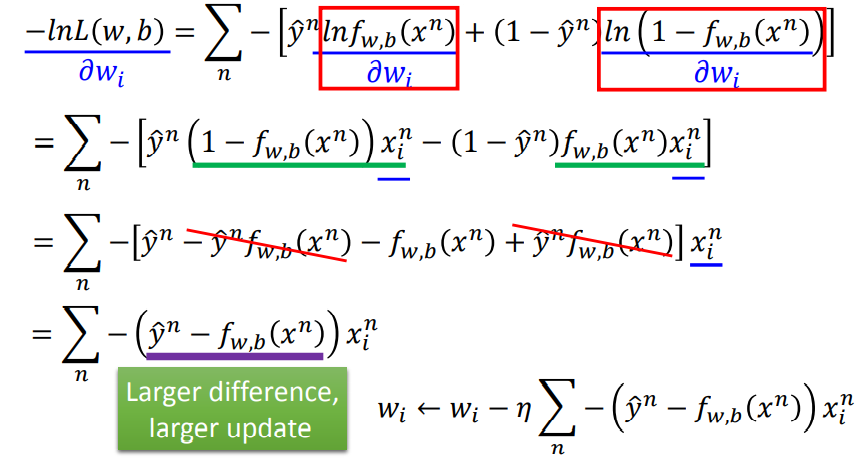

# 函数Function

由先验事件，我们可以得到逻辑回归的函数：

其通过图的形式可以表示成如下：

# 损失函数Loss

损失函数的定义为`$L(w,b)$`是样本集通过Function预测发生其对应事件的**最大可能性**。 则可以将Loss定义为如下：

这里有个小技巧，有利于Gradient Descent求微分，具体如下：

# 优化Optimization

通过上述的定义，我们可以轻松求Loss的微分，并且最终的结果也产生实际意义：

这里思考一下，如果Loss不使用Cross Entropy而是使用MSE，则在微分时得到如下结果:

这样的结果显然不利于梯度下降，并且我们可以比较它们的Loss曲线看出：

# 多分类器Multi-class Classification

多分类其的函数定义可以借鉴Binary Classification，其最后需要引用`softmax`以便使不同结果的差距放大。

但是，逻辑回归仍然存在如下问题，如下的分类任务无法很好的用一条直线进行划分：

因此，我们可以尝试将样本点进行线性变化后，再进行分类，其过程就变成如下这样：

# 参考链接

> - [李宏毅机器学习2021Classification PDF](https://speech.ee.ntu.edu.tw/~hylee/ml/ml2021-course-data/classification_v2.pdf)
> - [李宏毅机器学习2020LogisticRegression PDF](https://speech.ee.ntu.edu.tw/~tlkagk/courses/ML_2016/Lecture/Logistic%20Regression%20(v3).pdf)
> - [李宏毅机器学习2020LogisticRegression视频课](https://www.bilibili.com/video/BV1Wv411h7kN?p=19)
