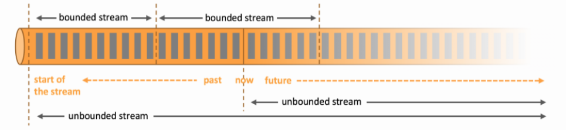
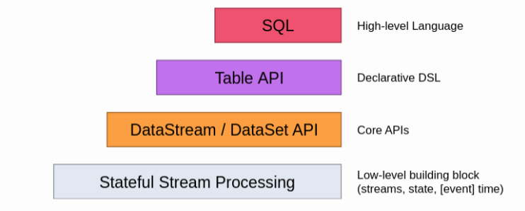
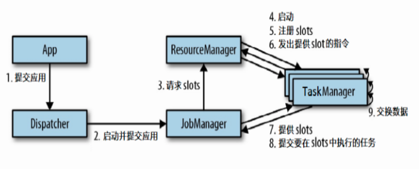
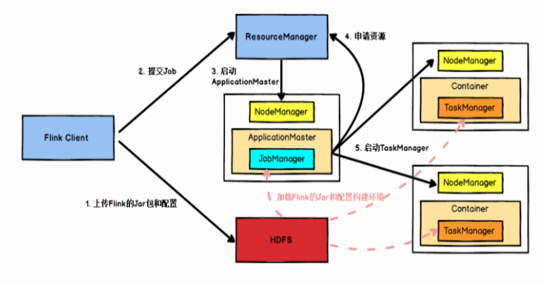
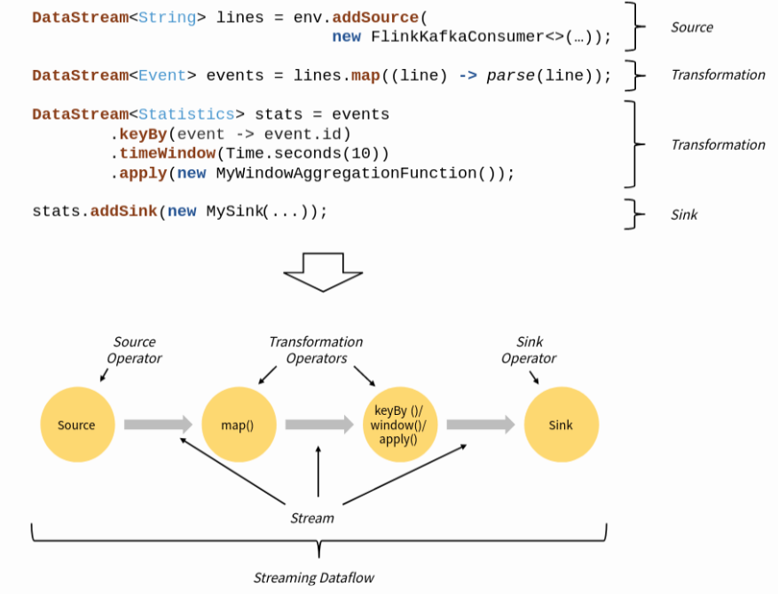
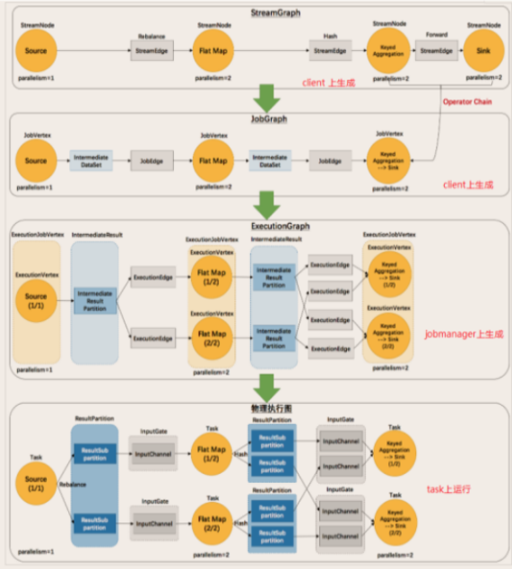
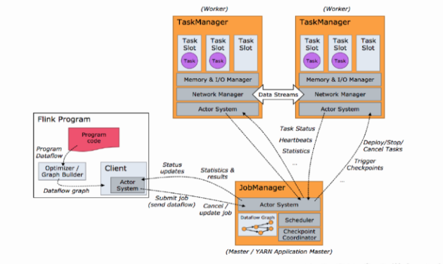
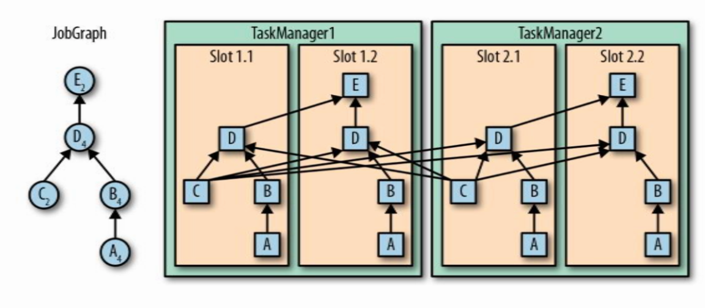

# Flink基本概念

Flink世界观即使**流(Stream)**，其旨在**“Apache Flink是一个分布式、高性能、随时可用以及准确的流处理应用程序打造的开源流式处理框架”**，用于对**有界和无界的数据进行有状态计算**。

- **批处理**：有界数据流处理的范例。在这种模式下，你可以选择在计算结果输出之前输入整个数据集，这也就意味着你可以对整个数据集的数据进行排序、统计或汇总计算后再输出结果。

- **流处理**：正相反，其涉及无界数据流。至少理论上来说，它的数据输入永远不会结束，因此程序必须持续不断地对到达的数据进行处理。

这里需要阐述几个基本的名词概念：

> 状态 (State)：指的是Flink在做流处理时，中间数据称为状态，状态存储可以放在HDFS、S3、NFS上；
>
> 流式 (Dataflows)：由用户自定义算子转换而来，并形成有向图；
>
> 插槽 (Slots)：可以理解成某个TaskManager任务管理器节点上可以使用的并发线程数；
>
> 汇 (Sink)：可以理解成经过流式的数据最终输出的位置。

# Flink API支持

Flink支持4种API操作，从下自上越**抽象**、表达含义越**简明**、使用越**简单**。自上到下越**具体**，表达能力越**丰富**，使用越**灵活**。

# Flink 运行架构

Flink运行架构主要由：

- Job Manager: 作业管理器，可以理解为Application Master应用程序的主进程；
- Task Manager: 任务管理器，可以理解为Application Execution执行器；
- Resource Manager: 资源管理器，负责Slots插槽资源的管理；
- Dispacher: 分发器，跨作业的Rest接口，可以在启动时将Application移交到JobManager，也可以充当WebUI使用。

如果我们的Flink是在Yarn上运行使用，其运行架构可以表示成：

## Flink数据流与执行图

所有的Flink程序都由**Source**、**Transformation**、**Sink**三个部分组成，Flink Application运行时会被映射成为**“逻辑数据流”（Dataflow）**，组成一个DAG图。

Flink对Dataflow会分四次处理：

> Stream Graph: 用户利用API编写代码后，提交时产生的**最初**的图；
>
> Job Graph: Job Manager将用户提交的Stream Graph进行**优化合并**，减少数据在不同节点间传输的序列化和反序列化时间；
>
> Execution Graph: 执行图，Job Manager根据Job Graph生成执行图，是**Job Graph的并行版本**，也是最底层的核心数据结构；
>
> 物理执行图: Job Manager根据Execution Graph对Job进行调度后，在各个Task Manager上部署Task后形成的图。

## Flink任务调度

对于一个Flink Application，在Client客户端提交时，会转换成一个Dataflow Graph数据流图（具体过程是：`Stream Graph -> Job Graph -> Execution Graph -> 物理执行图`），并转交给Job Manager。Job Manager将向Task Manager集群申请Slots插槽，当空闲插槽数满足Application的需求后，由Task Manager执行。

同时，Slots支持子任务共享，也就是Flink允许多个具有先后次序的Subtask子任务共享一个Slot，从而减少不同Slots之间交换数据的耗时。如下例中，共有16个子任务，但仅仅只需要4个Slot，通常我们可以理解为一个Flink Application的个数与当前最大的Parallelism并行度有关。

如果我们需要将共享Slot的子任务拆开，可以在每个子任务上设置Slot共享组名，如`.map(v -> v*=2).slotSharingGroup("test")`。

## 任务链

关于任务链（Operator Chain）中，任意两个子任务Subtasks可以合并的前提是：

> 1. 同一个共享组
>
> 2. One-to-One模式
>
> 3. 相同的Parallelism并行度

在任务链（Operator Chain）中，当我们不希望两个本可以合并的子任务合并，可以采用如下方法：

> 1. 在某个子任务上API上加上`.disableChaining()`
>
> 2. 设置不同的共享组`.slotSharingGroup()`
>
> 3. 设置全局不合并`env.disableOperatorChaining()`
>
> 4. 在两个子任务中间重分区`.shuffle()`
