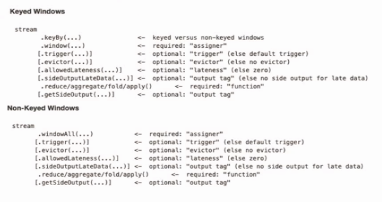

# Environment

对于Bounded有界流数据，可以采用`ExecutionEnvironment`创建执行环境；对于Unbounded无界流数据，可以采用`StreamExecutionEnvironment`创建。具体创建方法如下：

```java
StreamExecutionEnvironment.createLocalEnvironment(parralism);
```

```java
StreamExecutionEnvironment.createRemoteEnvironment(hostname,port,jars);
```

```java
StreamExecutionEnvironment.getExecutionEnvironment(); // 自动识别当前执行环境并实例化执行环境对象【推荐】
```

# Source

## 从集合中读取数据

```java
        DataStream<Tuple2> input = env.fromCollection(Arrays.asList(
                new Tuple2(1, "hello"),
                new Tuple2(2, "world"),
                new Tuple2(3, "hello"),
                new Tuple2(4, "flink")
        ));
```

```java
        DataStream<Tuple2> input = env.fromElements(
                new Tuple2(1, "hello"),
                new Tuple2(2, "world"),
                new Tuple2(3, "hello"),
                new Tuple2(4, "flink")
        );
```

## 从文件读取数据

```java
        env.readFile(new FileInputFormat<Object>() {
            @Override
            public boolean reachedEnd() throws IOException { return false; }
            @Override
            public Object nextRecord(Object reuse) throws IOException { return null; }
        },FILE_PATH);
```

```java
        env.readTextFile(FILE_PATH, CHAR_SET)
```

## 从Kafka读取数据

- 引入flink-connector-kafka组件

```xml
        <dependency>
            <groupId>org.apache.flink</groupId>
            <artifactId>flink-connector-kafka_${scala.version}</artifactId>
            <version>${flink.version}</version>
        </dependency>
```

- 从Kafka消费数据

```java
        Properties properties = new Properties() {{
            this.setProperty("boostrap.servers", "172.37.4.155:9092");
            this.setProperty("group.id", "consumer-group");
        }};
        
        FlinkKafkaConsumer<ObjectNode> kafkaConsumer = new FlinkKafkaConsumer<>(
                "kafkaTopic",
                new JSONKeyValueDeserializationSchema(false), //要求Kafka中的数据已经序列化为比特数组
                properties
        );
        
        kafkaConsumer.setStartFromEarliest();     // 尽可能从最早的记录开始
        kafkaConsumer.setStartFromLatest();       // 从最新的记录开始
        kafkaConsumer.setStartFromTimestamp(1000); // 从指定的时间开始（毫秒）
        kafkaConsumer.setStartFromGroupOffsets(); // 默认的方法
        
        DataStream<ObjectNode> inputSource = env.addSource(kafkaConsumer);
```

Flink消费Kafka时支持分区偏移量**、**checkpoint容错**、**分区发现**、**时间戳抽取**以及**watermark 发送**，此处参考[官方文档](https://ci.apache.org/projects/flink/flink-docs-release-1.13/docs/connectors/datastream/kafka/#kafka-consumers-start-position-configuration)。

## 自定义Source源

```java
    public static class WordCountSource implements SourceFunction<String> {

        public boolean flag = false;

        @Override
        public void run(SourceContext<String> ctx) throws Exception {
            List<String> sourceTemplate = new ArrayList<>() {{
                this.add("hello world");
                this.add("hello scala");
                this.add("hello flink");
                this.add("happy birthday");
                this.add("how about you");
                this.add("this is an unbounded stream");
            }};

            while (!flag) {
                for (String word : sourceTemplate) {
                    ctx.collect(word);
                }
                Thread.sleep(100);
            }
        }

        @Override
        public void cancel() {
            this.flag = true;
        }

    }
```


# Transform

|        Transform Type         |                   Function Meaning                   |                           Comment                            |
| :---------------------------: | :--------------------------------------------------: | :----------------------------------------------------------: |
|          MapFunction          |                 [□□□] → map → [●●●]                  |                       将数据一对一转换                       |
|        FlatMapFunction        |                [□] → flatMap → [●●●]                 |                       将数据一对多转换                       |
|        FilterFunction         |                [□□□] → filter → [□□]                 |                        将数据进行过滤                        |
|             KeyBy             |              [□□□] → keyBy → [{□},{□□}]              |    将数据进行分类并重分区 **(DataStream → KeyedStream)**     |
|      Rolling Aggregation      | [{□},{□□}] → sum\|min\|max\|minBy\|maxBy → [{□},{□}] | 将分组后的数据进行**滚动聚合** **(KeyedStream → DataStream)** |
|        ReduceFunction         |           [{□},{□□}] → reduce → [{●},{●}]            |  将分组后的数据进行**规约** **(KeyedStream → DataStream)**   |
| Split&Select (OutputSelector) |            [□□□] → split&select  → [□,□□]            | 将**数据流**拆分成多个组，可以理解为给数据流盖戳 **(DataStream → SplitedStream)** |
|         Connect&CoMap         |            [□,●●] → connect&coMap → [□●●]            | 将2个数据流合并到一个数据流 **(DataStreams → ConnectedStream)** |
|             Union             |              [□,□,□□] → union → [□□□□]               | 将多条数据类型相同的数据流合并成一条流 **(DataStreams → DataStream)** |

*补各种DataStream转换图*


# Sink

## Kafka Sink

- 引入flink-connector-kafka组件

```xml
        <dependency>
            <groupId>org.apache.flink</groupId>
            <artifactId>flink-connector-kafka_${scala.version}</artifactId>
            <version>${flink.version}</version>
        </dependency>
```

- 向Kafka生产数据

```java
        Properties properties = new Properties() {{
            this.setProperty("bootstrap.servers", "172.37.4.156:9092");
            this.setProperty("group.id", "flink-kafka");
            this.setProperty("key.deserializer", StringDeserializer.class.toString());
            this.setProperty("value.deserializer", StringDeserializer.class.toString());
        }};

        FlinkKafkaConsumer<String> kafkaConsumer = new FlinkKafkaConsumer<>(
                "demo-topic",
                new SimpleStringSchema(),
                properties
        );
        kafkaConsumer.setStartFromEarliest();     // 尽可能从最早的记录开始
        kafkaConsumer.setStartFromLatest();       // 从最新的记录开始
        kafkaConsumer.setStartFromTimestamp(1000); // 从指定的时间开始（毫秒）
        kafkaConsumer.setStartFromGroupOffsets(); // 默认的方法

        DataStream<String> streamSource = env.addSource(kafkaConsumer).shuffle();

        streamSource.addSink(new FlinkKafkaProducer<String>(
                properties.getProperty("bootstrap.servers"), //Kafka地址
                "sink-test", //Kafka Topic名称
                new SimpleStringSchema() //序列器
        ));
```


# Window

- 时间窗口（Time Window）
  - [滚动时间窗口（Tumbling Windows）](https://ci.apache.org/projects/flink/flink-docs-release-1.13/zh/docs/dev/datastream/operators/windows/#tumbling-windows)：时间对齐，窗口长度固定，**没有重叠**；
  - [滑动时间窗口（Sliding Windows）](https://ci.apache.org/projects/flink/flink-docs-release-1.13/zh/docs/dev/datastream/operators/windows/#sliding-windows)：窗口长度固定，可以**有重叠**，某个数据同时属于（window size / window slide）；
  - [会话窗口（Session Windows）](https://ci.apache.org/projects/flink/flink-docs-release-1.13/zh/docs/dev/datastream/operators/windows/#session-windows)：一段时间（timeout）没有接受到数据就会产生新的会话窗口，**时间不对齐**。
- 计数窗口（Count Window）
  - [滚动计数窗口](https://ci.apache.org/projects/flink/flink-docs-release-1.13/zh/docs/dev/datastream/operators/windows/#global-windows)
  - [滑动计数窗口](https://ci.apache.org/projects/flink/flink-docs-release-1.13/zh/docs/dev/datastream/operators/windows/#global-windows)

## Window API

窗口分配器`window()`方法应当在`keyBy`后使用：

```java
        // Note: This operation is inherently non-parallel since all elements have to pass through the same operator instance.
        // 全部数据会汇总到一起做window开窗操作，相当于global()的分区，不推荐使用
        inputSource.windowAll(
                TumblingEventTimeWindows.of(Time.minutes(1))
        );

        inputSource
                .keyBy("id")
                .window(TumblingEventTimeWindows.of(Time.minutes(1))); // 滚动时间窗口，可直接使用.timeWindow(...)

        inputSource
                .keyBy("id")
                .window(EventTimeSessionWindows.withGap(Time.minutes(1))); // 会话时间窗口

        inputSource
                .keyBy("id")
                .countWindow(100); // 滚动计数窗口

        inputSource
                .keyBy("id")
                .countWindow(100,50); // 滑动计数窗口
```

## Window Function

Window Function定义了要对窗口收集的数据进行计算的操作（keyBy后的聚合操作），可以分为如下两类：

- 增量聚合函数（Incremental Aggregation Functions）
  - 每条数据到来就计算，保持简单状态，如: ReduceFunction, AggregateFunction

- 全窗口函数（Full Window Function)
  - 先把窗口内的数据收集起来（称为**保存状态State**），等到计算时在遍历窗口内的所有数据，如: ProcessWindowFunction, WindowFunction

```java
		// ReduceFunction
        inputSource.keyBy("id")
                .timeWindow(Time.minutes(5))
                .reduce(new ReduceFunction<String>() {
                    @Override
                    public String reduce(String value1, String value2) throws Exception {
                        return null;
                    }
                });

        // AggregateFunction
        inputSource.keyBy("id")
                .timeWindow(Time.minutes(5))
                .aggregate(new AggregateFunction<String, Integer, Integer>() {   //AggregateFunction<IN, ACCUMLATOR, OUT>
                    @Override
                    public Integer createAccumulator() {
                        return null;
                    }

                    @Override
                    public Integer add(String value, Integer accumulator) {
                        return null;
                    }

                    @Override
                    public Integer getResult(Integer accumulator) {
                        return null;
                    }

                    @Override
                    public Integer merge(Integer a, Integer b) {
                        return null;
                    }
                });

        // WindowFunction
        inputSource.keyBy("id")
                .timeWindow(Time.minutes(5))
                .apply(new WindowFunction<String, Integer, Tuple, TimeWindow>() { //WindowFunction<IN, OUT, KEY, W extends Window>
                    @Override
                    public void apply(
                            Tuple tuple,
                            TimeWindow window,
                            Iterable<String> input,
                            Collector<Integer> out) throws Exception {
                        Integer count = IteratorUtils.toList(input.iterator()).size();
                        out.collect(count);
                    }
                });
```

## 其他API

- `trigger()`触发器，定义了window什么时候关闭，触发计算并输出结果
- `evitor()`移除器，定义了移除某些数据的逻辑
- `allowOutputLateness()`允许处理迟到的数据
- `sideOutputLateDate`将迟到的数据放入旁路输出流
- `getSideOutput()`获取旁路输出流




# 参考链接

- [Flink数据源官方文档](https://ci.apache.org/projects/flink/flink-docs-release-1.13/zh/docs/connectors/datastream/overview/)

