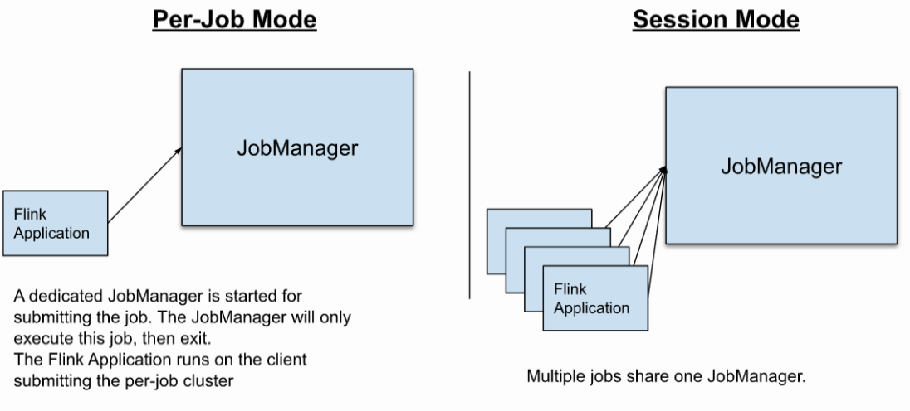

# Standalone模式

Flink的独立集群环境部署方式如下：

## 下载并配置Flink

```
# 下载Flink二进制包并解压
wget https://archive.apache.org/dist/flink/flink-1.13.1/flink-1.13.1-bin-scala_2.12.tgz

# 根目录下配置
vim ./conf/flink-conf.yaml

# 配置Master地址
vim ./conf/masters

# 配置Slaves地址
vim ./conf/workers
```

## 启动执行

```
# 启动Standalone集群
./bin/start-cluster.sh

# 关闭Standalone集群
./bin/stop-cluster.sh
```

# Yarn模式

之所以使用Yarn模式，在于通过Yarn资源协调可以根据FlinkJob运行中需要的卡槽(Slots)数目动态调整TaskManager资源。其中使用Yarn做资源管理的好处在于集群运行时，可能会有很多的集群实例包括MapReduce、Spark、Flink等，若它们全基于Yarn就可以完成资源分配，就可以减少单个实例集群的维护，提高集群的利用率。

## 配置环境变量

```
export HADOOP_HOME=`/opt/hadoop`
export HADOOP_CLASSPATH=`hadoop classpath`
```

## 下载并配置Flink

```
# 下载Flink二进制包并解压
wget https://archive.apache.org/dist/flink/flink-1.13.1/flink-1.13.1-bin-scala_2.12.tgz

# 下载Flink-Hadoop支持包并放在Flink根目录的lib文件夹下
wget https://repo.maven.apache.org/maven2/org/apache/flink/flink-shaded-hadoop-2-uber/2.8.3-10.0/flink-shaded-hadoop-2-uber-2.8.3-10.0.jar
mv ./flink-shaded-hadoop-2-uber-2.8.3-10.0.jar ./flink/lib

# 其他配置
vim ./conf/flink-conf.yaml
```

## 运行模式

Flink On Yarn可以通过两种运行模式，具体详情参考[官方详解](https://ci.apache.org/projects/flink/flink-docs-release-1.13/zh/docs/deployment/overview/#deployment-modes)：

> Per-Job Mode: 对于一个Job会分离JobManager，一个Job会对应一个JobManager，不会因为Slots不够用而等待；
>
> Session Mode: 多个Job共享一个JobManager，有时会引起Slots不够用导致一些Job等待，开发环境**建议使用**。



### Per-Job Mode

```
# 命令行手动提交FlinkJob
./bin/flink run --target yarn-per-job --detached  \
    ./examples/streaming/TopSpeedWindowing.jar

# 列出Yarn上执行的FlinkJob
./bin/flink list --target yarn-per-job \
    -Dyarn.application.id=application_XXXX_YY

# 关闭Yarn上执行的某个FlinkJob
./bin/flink cancel --target yarn-per-job \
    -Dyarn.application.id=application_XXXX_YY <jobId>
```

### Session Mode

```
# 开辟Yarn资源
./bin/yarn-session.sh \
    --jobManagerMemory 1024 \    # -jm 1024
    --taskManagerMemory 2048 \    # -tm 2048
    --detached    # -d

# 命令行手动提交FlinkJob
./bin/flink run --target yarn-session --detached  \
    -Dyarn.application.id=application_XXXX_YY \
    ./examples/streaming/TopSpeedWindowing.jar

# 列出Yarn上执行的FlinkJob
./bin/flink list --target yarn-session \
    -Dyarn.application.id=application_XXXX_YY

# 关闭Yarn上执行的某个FlinkJob
./bin/flink cancel --target yarn-session \
    -Dyarn.application.id=application_XXXX_YY <jobId>
```

上述两种模式启动完成后都可以在Yarn WebUI上查找到。

# 参考链接

> [Flink官方教程](https://ci.apache.org/projects/flink/flink-docs-release-1.13/zh/docs/deployment/resource-providers/yarn/)
>
> [Flink OnYarn两种运行模式](https://blog.csdn.net/Jiny_li/article/details/85944203)

