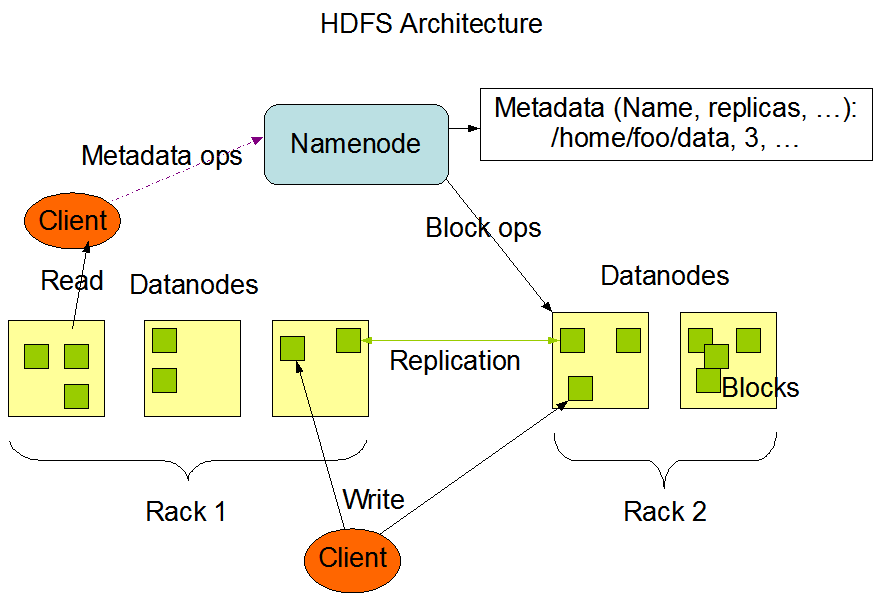
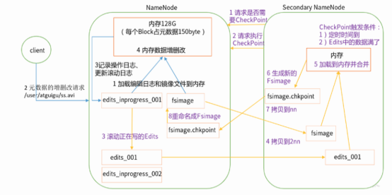

# HDFS的基本概念

HDFS(Hadoop Distributed File System) Hadoop分布式文件系统，适用于将大型文件分发到不同的节点上。



HDFS的基本组成可以包括：

- NameNode (nn): HDFS的元数据管理者，管理HDFS的路径空间、副本策略、数据块映射关系、处理客户端请求；
- DataNode: 存储数据块并进行读写操作；
- Secondary NameNode (2nn): 定期合并FsImages和Edits并推送到NameNode；
- Client: HDFS客户端，负责文件的切片(Split)以及和NameNode/DataNode的交互。


## HDFS Block文件块

Hadoop2.x中一个Block文件块的大小为128MB，老版本64MB。

值得注意的是，对于一个Block文件的大小，**如果Block太大，则需要较多时间在节点间进行文件的传输，如果Block太小，则NameNode需要记录较多的文件块映射记录占用较多的资源**。


## Secondary NameNode

需要注意的是，Secondary NameNode并不是对NameNode的拷贝。之所以引入Secondary NameNode，就需要讲解一下NameNode遇到的问题。

NameNode对Block的映射元数据如果存储在硬盘，则需要较长的读写时间，实作中不可考虑。如果在NameNode中元数据存储在内存，虽然读写速度有保证，但是很难保证出现故障后这些Block映射元数据和记录在硬盘中的镜像一致。

因此NameNode中将**FSImages(文件系统镜像)**和**Edits(读写日志)**进行分离。其中的**Edits**记录了对映射元数据的**读写日志**，由**Secondary NameNode负责将Edits和FSImages进行定期合并**保证一致性。



# HDFS的Shell命令行操作

HDFS命令行可以采用`./bin/hadoop fs`或`./bin/hdfs dfs`进行操作，其中后种方法是前一种方法的集成。

Example：

```
./bin/hdfs dfs -put localfile hdfs://hadoop-vm-1:9000/
```

其他更多的Hadoop HDFS命令行操作，可以参考[官方手册](http://hadoop.apache.org/docs/current/hadoop-project-dist/hadoop-hdfs/HDFSCommands.html)。

# HDFS的Java API操作

*待学习*
