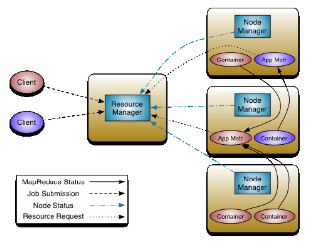

# Hadoop概述

Hadoop从2.x开始，原生组件主要为如下：

- Hadoop HDFS: 分布式存储
- Hadoop MapReduce: 分布式计算
- Hadoop Yarn: 资源协调组件
- Hadoop Common: 通用组件包

并且对于Hadoop集群中的每个主机，又可以分为如下身份：

- HDFS
    - NameNode: 可以在内存中存储分布式数据的元数据(metadata)
    - Secondary NameNode: 是NameNode节点的辅助节点，可以定期合并FSImage和Edits
    - DataNode: 存储具体的分布式数据内容的节点
- Yarn
    - ResourceManager: 资源分配调度的主节点
    - NodeManager: 负责处理具体任务
    - ApplicationMaster: 负责某个MR任务的监控和容错
    - Container: 对节点资源的抽象
- MapReduce
    - Map: 并行处理输入数据
    - Reduce: 对Map结果汇总



# Hadoop3.x安装

Hadoop3下载地址: https://downloads.apache.org/hadoop/common/hadoop-3.2.2/hadoop-3.2.2.tar.gz

## 伪分布式安装

### 安装依赖包

```
sudo apt-get install ssh
sudo apt-get install pdsh
```

### 配置用户和网络

- 关闭防火墙

```
sudo ufw disable
```

- 创建用户和用户组

```
sudo addgroup hadoop
sudo adduser -ingroup hadoop hadoop
```

- 为hadoop用户添加权限

*[注] hadoop这一行不要直接放到root行下面，因为所有用户都属于wheel组,先配置了hadoop具有免密功能，但是程序执行到%wheel行时，该功能又被覆盖回需要密码。所以hadoop要放到%wheel这行下面。*

```
sudo vim /etc/sudoers
```

```
## Allow root to run any commands anywhere
root = ALL=(ALL) ALL
## Allows people in group wheel to run all commands
%whell ALL=(ALL) ALL

hadoop ALL=(ALL) NOPASSWD:ALL
```

- 配置网络

```
vim /etc/hosts
```

```
127.0.0.1 hadoop
```

- 配置环境变量

```
vim /etc/profile
```

```
export HADOOP_HOME=/opt/hadoop
export PATH=$PATH:$HADOOP_HOME/bin:$HADOOP_HOME/sbin
```

```
source /etc/profile
```

### HDFS配置集群

- 配置`./etc/hadoop/core-site.xml`:

```
  <configuration>
    <!-- 指定HDFS的NameNode地址 -->
    <property>
        <name>fs.defaultFS</name>
        ./etc/hadoop/<value>hdfs://hadoop:9000</value>
    </property>
    
    <!-- Hadoop运行时的存储目录 -->
    <property>
        <name>hadoop.tmp.dir</name>
        <value>/opt/hadoop/data/tmp</value>
    </property>
    
    <!-- 配置HDFS网页登录使用的静态用户为hadoop -->
    <property>
        <name>hadoop.http.staticuser.user</name>
        <value>hadoop</value>
    </property>
</configuration>
```

- 配置`./etc/hadoop/hdfs-site.xml`:

```
<!-- HDFS副本数量 -->
<property>
    <name>dfs.replication</name>
    <value>1</value>
</property>

<!-- nnWeb端访问地址-->
<property>
    <name>dfs.namenode.http-address</name>
    <value>hadoop:9870</value>
</property>

<!-- 2nnWeb端访问地址-->
<property>
    <name>dfs.namenode.secondary.http-address</name>
    <value>hadoop:9868</value>
</property>
```

### YARN配置

- 配置`./etc/hadoop/yarn-site.xml`:

```
<!-- Reducer获取数据的方式 -->
<property>
    <name>yarn.nodemanager.aux-services</name>
    <value>mapreduce_shuffle</value>
</property>

<!-- 指定YARN的ResourceManager的地址 -->
<property>
    <name>yarn.resourcemanager.hostname</name>
    <value>hadoop</value>
</property>

<!-- 环境变量的继承 -->
<property>
    <name>yarn.nodemanager.env-whitelist</name>
    <value>JAVA_HOME,HADOOP_COMMON_HOME,HADOOP_HDFS_HOME,HADOOP_CONF_DIR,CLASSPATH_PREPEND_DISTCACHE,HADOOP_YARN_HOME,HADOOP_MAPRED_HOME</value>
</property>
```

- 配置`./etc/hadoop/mapred-site.xml`

```
<!-- 指定MR运行在YARN上 -->
<property>
    <name>mapreduce.framework.name</name>
    <value>yarn</value>
</property>
```

### Hadoop运行启动

- 首先需要导入Java的运行环境

```
export JAVA_HOME=/opt/jdk
```

- 启动HDFS

```
./bin/hdfs namenode -format # 第一次启动需要格式化NameNode
./bin/hdfs --daemon start namenode
./bin/hdfs --daemon start datanode
jps
```

jps将显示具体的Java正在运行的进程，启动成功后，查看HDFS系统可以访问: `http://localhost:9870/dfshealth.html`

- 启动YARN

```
./bin/yarn --daemon start resourcemanager
./bin/yarn --daemon start nodemanager
```

YARN可以通过访问: `http://localhost:8042/`

通过`jps`可以查看当前伪集群是否启动完成，具体进程应当包含如下：

```
2289 DataNode
4866 NodeManager
2183 NameNode
4603 ResourceManager
```

# 参考链接

> - [Hadoop官方安装手册](https://hadoop.apache.org/docs/stable/hadoop-project-dist/hadoop-common/SingleCluster.html)