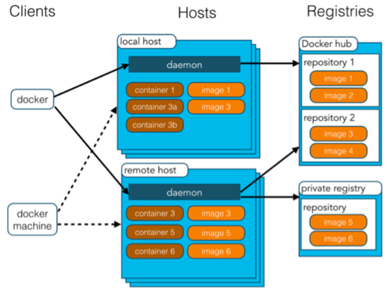

# Docker基本概念

Docker是一种容器化技术，相比较于虚拟机能够更加充分的利用系统资源，Docker主要分为如下部分：

- Image: 镜像，就相当于是一个root文件系统。比如官方镜像Ubuntu:16.04就包含了完整的一套Ubuntu16.04 最小系统的root文件系统。
- Container: 容器，如果镜像比作类，则它就是类的具体实例，容器可以被创建、启动、停止、删除、暂停等。
- Repository: 仓库，仓库可看成一个代码控制中心，用来保存镜像。

# Images镜像的使用

- 查看本地镜像: `docker images`
- 从Docker Hub获取镜像: `docker pull ubuntu:18.04`
- 从Docker Hub查找镜像: `docker search ubuntu`
- 删除本地镜像: `docker rmi ubuntu:18.04`

*[注] 手动创建镜像请参考Dockerfile*

# Container容器的使用

- 查看本地运行容器: `docker containers`
- 查看本地所有容器: `docker ps -a`
- 创建容器: `docker container run -itd --name hadoop -p 127.0.0.1:2333:12333 --network host ubuntu:18.04 /bin/bash`
- 进入容器: `docker container exec -it hadoop /bin/bash`
- 关闭容器: `docker container stop hadoop`
- 启动容器: `docker container start hadoop`
